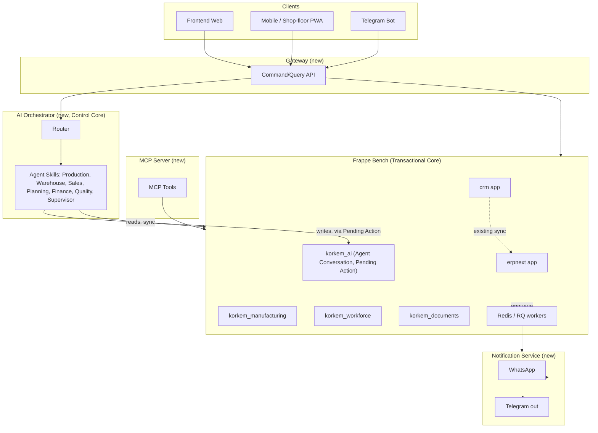

# System Architecture
## AI Furniture Manufacturing Operating System — Phase 04 of the Architecture Pipeline

Version: 1.0 — Draft for approval. Documentation only; no code was written or modified to produce this document.

Builds directly on `.ai/architecture/domain_model.md` (v2.0, canonical). Where that document defines *what the business entities and rules are*, this document defines *what runs, where data physically lives, how the pieces talk to each other, and what stays synchronous vs. asynchronous.* Every claim about an existing repo's behavior is inherited from `.ai/research/report_erpnext.md` and the CRM/Relaticle research already folded into the domain model — this document does not re-research the source repos, it only makes system-level decisions on top of what's already confirmed.

---

## 1. What is the Core?

There are exactly **two** cores, deliberately kept separate because they change at different rates and for different reasons:

1. **The Transactional Core — the Frappe bench.** ERPNext + Frappe CRM already run on one shared framework, one shared database, one shared permission model (confirmed: both are Frappe apps; `report_erpnext.md` confirms the generic `/api/resource/*` + whitelisted-RPC surface; CRM↔ERPNext already sync Customer and Product live). This is the **system of record** for every business fact in `domain_model.md` — customers, deals, production orders, materials, workforce, payroll, documents. It does not change based on which AI features ship; it changes based on which business rules change.
2. **The Control Core — the AI Orchestrator.** A new service. It owns the *conversation* with users and agents, and the *proposal/approval* lifecycle (Pending Action) — never business data itself. It changes as AI capability grows, independent of the transactional core underneath it.

Everything else in this document (Gateway, Frontend, Mobile, Telegram, WhatsApp, MCP) is a client or adapter around these two cores — not a third place where business truth can live. This is the single most important structural decision in this document, and every other decision below is downstream of it.

## 2. Bounded Contexts → Services

`domain_model.md` defined 8 bounded contexts. This section maps each to a **physical deployable unit**. The mapping is deliberately many-to-one in several places — a bounded context is a modeling boundary, not automatically a network boundary, and collapsing several contexts into one Frappe bench avoids the classic mistake of turning a clean domain model into an unjustified microservice sprawl.

| Bounded Context | Deployable unit | Why here |
|---|---|---|
| Sales & Relationship | Frappe bench → `crm` app | Already lives here; already bridges to ERPNext |
| Manufacturing | Frappe bench → `erpnext` app + new `korkem_manufacturing` custom app | Work Order/BOM/Job Card already here; Facade Item/Color Group/Milling Profile added via a new custom app (not a fork of `erpnext`) |
| Materials & Warehouse | Frappe bench → `erpnext` app + `korkem_manufacturing` custom app | Item/Warehouse/Stock Entry already here; Decor/Roll/Offcut are `Item`-subtype doctypes added by the custom app |
| Workforce & Payroll | Frappe bench → new `korkem_workforce` custom app | Deliberately its own custom app, not folded into `korkem_manufacturing` — different rate of change, different owning team likely (payroll/finance vs. production) |
| Collaboration (Task/Note) | Frappe bench → framework-native, extended | No new app needed; existing `CRM Task`/`FCRM Note` doctypes get `Work Order` added to their valid target list |
| AI & Automation | **AI Orchestrator** (new service) for conversation/routing logic + Frappe bench → new `korkem_ai` custom app for the *data* (Agent Conversation, Agent Message, Pending Action, AI Credit Ledger as Doctypes) | Logic and data are split deliberately — see §11 (Source of Truth) for why the data half lives in the bench, not a new database |
| Documents & Client Communication | Frappe bench → new `korkem_documents` custom app, using Frappe's native print-format/report/xlsxwriter machinery | No new document-generation service; Frappe already does this natively |
| Identity & Access | Frappe bench, framework-native RBAC | Pin Credential is a thin doctype in `korkem_workforce` that resolves to a real Frappe session — no parallel identity service |

**New custom Frappe apps introduced**: `korkem_manufacturing`, `korkem_workforce`, `korkem_documents`, `korkem_ai`. Each is a standard Frappe app (installed into the same bench alongside `erpnext`/`crm`, per Frappe's own extension convention — `hooks.py`, Custom Fields, new Doctypes) — **not** a fork of any vendored repo, consistent with the git-structure rule in `CLAUDE.md` that `erpnext/`, `frappe/`, `crm/`, `relaticle/` stay pristine upstream clones.

## 3. Services Catalog

| Service | New or existing | Responsibility | Talks to |
|---|---|---|---|
| **Frappe Bench** | Existing (erpnext, crm) + extended (4 new custom apps) | System of record for all business data; enforces permissions; runs scheduled/background jobs | Nothing outside itself except via its own API surface (inbound only) |
| **AI Orchestrator** | New | Owns conversation routing, agent invocation, Pending Action creation; stateless business logic | Frappe Bench (API, read/write), MCP tool layer, Notification Service |
| **Gateway** | New | Single API contract for all clients; translates Commands/Queries (`domain_model.md` §12-13) into Frappe API calls; PIN→session translation; response shaping for compact/detailed order views | Frappe Bench (API), AI Orchestrator |
| **Notification Service** | New, thin | Sends WhatsApp/Telegram messages triggered by domain events; logs to Outbound Notification doctype | Frappe Bench (reads event/queue data, writes log), WhatsApp Business API, Telegram Bot API |
| **MCP Server** | New | Exposes Commands/Queries as MCP tools for AI agents (including Claude Code itself, during continued development) | Frappe Bench (via Gateway or directly, see Phase 10) |
| **Frontend (web)** | New, in `frontend/` | Dark-UI desktop app: Orders table, Client Analytics, Warehouse, Payroll | Gateway only |
| **Mobile / Shop-floor PWA** | New, likely a responsive mode of the same frontend, not a separate codebase | PIN login, touch-friendly task view, bonus progress | Gateway only |
| **Telegram Bot** | Scaffold exists at `telegram/` | Optional alternate front-end for notifications/quick queries | Gateway only |

No service other than the Frappe Bench is allowed to hold a second copy of business data (enforced in §11-12).

## 4. Shared Libraries

- **`domain-contracts`** — generated types/schemas for every entity, Command, Query, and Event in `domain_model.md`, published once and consumed by Gateway, AI Orchestrator, MCP Server, and Frontend. Prevents the four consumer surfaces from drifting into four slightly-different definitions of "Production Order."
- **`frappe-client`** — a thin, permission-aware wrapper around Frappe's confirmed generic REST/RPC surface (`/api/resource/*`, whitelisted RPC, per `report_erpnext.md`). Every service that talks to the bench (Gateway, AI Orchestrator, Notification Service, MCP Server) uses this one client, not four hand-rolled HTTP callers.
- **`events-client`** — thin wrapper around Frappe's `frappe.publish_realtime` (websocket) for live UI updates and `frappe.enqueue` (background jobs) for async processing — see §8, no new broker introduced.

## 5. Plugin Surface

Two independent plugin surfaces, matching the two cores in §1:

1. **Frappe-side plugins** = new custom Frappe apps (exactly what `korkem_manufacturing`/`korkem_workforce`/`korkem_documents`/`korkem_ai` already are). Adding a new vertical later (per `PROJECT.md`'s furniture → wood → metal → construction expansion) means adding another custom app, not modifying existing ones.
2. **AI-side plugins** = agent "skills" registered into the AI Orchestrator (Production Agent, Warehouse Agent, Sales Agent, Planning Agent, Finance Agent, Quality Agent, Supervisor Agent from `domain_model.md` §15). Each skill is a scoped system prompt + an allow-list of MCP tools/Commands it may call — not a separate deployable service (see §10 Non-Goals for why microservice-per-agent is rejected).

## 6. AI Services (summary — full detail in Phase 09)

One AI Orchestrator process, internally organized into the 7 agent skills from `domain_model.md` §15, all mediated through **Pending Action** for any write. No agent ever calls a Frappe write API directly; every agent-proposed mutation is: agent → Orchestrator creates Pending Action (via `frappe-client`, so it's a real Doctype in the bench) → human approves/rejects via Gateway → Orchestrator (or the bench itself, on approval) executes the real Command.

## 7. API Architecture (summary — full detail in Phase 07)

Two API layers, deliberately kept simple rather than introducing a new query paradigm:

1. **Frappe native API** (internal only, never exposed directly to Frontend/Mobile/Telegram) — `/api/resource/*` + whitelisted RPC, already generic and stable per `report_erpnext.md`.
2. **Gateway API** (the one contract all clients use) — one endpoint per Command/Query already cataloged in `domain_model.md` §12-13 (`GetOrdersTable`, `GetOrderDetail`, `ConvertDealToProductionOrder`, etc.), REST/RPC-style rather than GraphQL — see §10 for why GraphQL was rejected here.

## 8. Event Architecture (summary — full detail in Phase 08)

Every event in `domain_model.md` §11 is carried two ways, both already native to Frappe (no new broker):

- **Live UI updates**: `frappe.publish_realtime` (websocket pub/sub) — e.g. `ProductionOrderStageCompleted` pushed to the Orders Table in real time. Confirmed pattern already used by ERPNext for stock-reposting progress.
- **Background processing**: `frappe.enqueue` (Redis-backed RQ worker, already the mechanism ERPNext itself uses for BOM cost recalculation and stock reposting per `report_erpnext.md`) — e.g. `RestockThresholdBreached` triggers a background check-and-flag job; `ProductionOrderReady` triggers the Notification Service via an enqueued job, not an inline synchronous call (so a slow WhatsApp API never blocks the stage-completion request).

## 9. Synchronization Strategy

- **CRM ↔ ERPNext**: already solved, already live (`create_customer_in_erpnext`, Product↔Item reconciliation) — extended, not rebuilt, to also propagate the new `originating_deal` link onto Work Order.
- **Gateway ↔ Frappe Bench**: the Gateway holds **no independent data store** for business entities — every Orders Table / Client Analytics read is a live (optionally short-TTL-cached) query against the bench, invalidated by the realtime events in §8, not a separately-synced copy.
- **AI Orchestrator ↔ Frappe Bench**: reads are synchronous, direct API calls; writes always go through Pending Action (§6), never a direct synchronous write from an agent.

## 10. Source of Truth

| Data | Source of truth | Notes |
|---|---|---|
| Customer, Contact, Deal, Lead | Frappe Bench (`crm` app) | Mirrored fields on ERPNext `Customer` are a *reflection*, not a second truth — the existing sync hook is the only writer on the ERPNext side |
| Production Order, Facade Item, Operation, BOM | Frappe Bench (`erpnext` + `korkem_manufacturing`) | |
| Item, Decor, Roll, Offcut, Warehouse, Stock Entry | Frappe Bench (`erpnext` + `korkem_manufacturing`) | |
| Employee, Role, Work Assignment, Bonus Rule, Advance, Defect Penalty, Payroll Period | Frappe Bench (`korkem_workforce`) | |
| Task, Note | Frappe Bench (framework-native) | |
| Agent Conversation, Agent Message, Pending Action, AI Credit Ledger | Frappe Bench (`korkem_ai`) | **Not** the AI Orchestrator's own database — see rationale below |
| Approval Sheet, Shop Sheet log, Outbound Notification log | Frappe Bench (`korkem_documents`) | |
| Conversation *in-flight* state (current turn being processed) | AI Orchestrator, transient/in-memory only | Not durable truth — durable truth is written back to `korkem_ai` doctypes at each turn boundary |

**Why Agent Conversation/Pending Action data lives in the bench, not a new AI database**: it is itself business data (an auditable record of "what did the AI propose and who approved it") and must be queryable/reportable alongside the rest of the business (per `PROJECT.md`'s "everything must be traceable/auditable"). Giving the AI Orchestrator its own persistent store for this would immediately create a second source of truth for something `domain_model.md`'s invariants explicitly forbid duplicating.

## 11. Data Ownership Matrix

Identical to the Source of Truth table in §10 — restated here as an explicit ownership statement: **the Frappe Bench owns 100% of durable business data.** No other service (Gateway, AI Orchestrator, Notification Service, MCP Server, Frontend, Mobile, Telegram) persists a durable copy of anything in `domain_model.md`'s entity catalog. Caches are allowed (§9) but must be invalidatable and are never treated as authoritative on conflict.

## 12. Data That Must Not Be Duplicated

Direct carry-forward of `domain_model.md`'s invariants, now stated as a system-level rule: Customer, Deal, Production Order, Item/Decor stock levels, and Employee/Payroll figures must have **exactly one writer** each (the bench, via the specific app that owns them). Any service that finds itself computing or storing a second copy of one of these (e.g. a Gateway-side "orders cache" that outlives its TTL and is read on write-conflict) is a bug, not a feature.

## 13. Synchronous vs. Asynchronous Processes

| Process | Sync or Async | Why |
|---|---|---|
| Orders Table / Order Detail / Client Stats reads | Synchronous | User is waiting on screen; Frappe's generic query API is fast enough per confirmed usage patterns in ERPNext itself |
| Direct human write (e.g. Production Manager adds a Facade Item) | Synchronous | Human has direct permission; no approval step needed |
| AI-agent-proposed write | Asynchronous (always via Pending Action) | Per `domain_model.md` invariant — no exceptions, even for "obviously safe" proposals |
| Bonus/Payroll Period close | Asynchronous, scheduled/batch | Aggregates a whole period; not a per-request operation |
| Material consumption reconciliation | Asynchronous, background job | Mirrors ERPNext's own confirmed pattern for stock-ledger reposting |
| Restock threshold scanning | Asynchronous, scheduled (reuses `scheduler_events`, the same mechanism ERPNext uses for its own hourly/daily jobs) | No need for real-time evaluation on every stock movement |
| WhatsApp/Telegram notification send | Asynchronous, enqueued | Never let a third-party API's latency block the request that triggered it |
| Excel Approval Sheet / Shop Sheet generation | Synchronous for typical order sizes; falls back to async+notify for unusually large orders | Frappe's native xlsxwriter/print-format rendering is fast for the expected item counts; no need to over-engineer this as async by default |

## 14. Background Workers & Queues

**One** queue technology: Redis-backed RQ workers, exactly as ERPNext/Frappe already use (`frappe.enqueue`, confirmed with real call sites and dedicated queues/timeouts in `report_erpnext.md`). The AI Orchestrator and Notification Service reuse the same Redis instance for their own job queues rather than introducing Kafka/RabbitMQ/a second Redis — there is no evidenced scale requirement yet that justifies a second messaging technology (see §10 Non-Goals).

## 15. Integrations

- **WhatsApp**: Business API (or a provider like Twilio/Meta Cloud API) called from the Notification Service. Frappe CRM already has a live precedent for exactly this shape of integration (`crm_telephony_agent`, `crm_twilio_settings`, `crm_exotel_settings` doctypes, confirmed in CRM research) — the Notification Service's WhatsApp settings doctype in `korkem_documents` should follow that same settings-doctype pattern, not invent a new configuration style.
- **Telegram**: existing `telegram/` scaffold at the workspace root — becomes a thin client of the Gateway, same as the web Frontend.
- **Excel/PDF generation**: native Frappe print-format + `xlsxwriter`/report machinery — no external document-generation service.

## 16. MCP (summary — full detail in Phase 10)

One MCP Server, exposing the Commands and Queries from `domain_model.md` §12-13 as MCP tools, backed by the same `frappe-client` shared library everything else uses — so an MCP-connected agent (including Claude Code during ongoing development, or a future third-party AI tool) operates through the exact same permission-checked, Pending-Action-gated path as every other AI Orchestrator agent. No separate, looser-permissioned "developer backdoor" API.

## 17. AI Memory Architecture

Two tiers, not one:

1. **Conversational memory** — Agent Conversation + Agent Message doctypes (§10), a straightforward turn-by-turn transcript per user/team, queried directly from the bench when a conversation resumes.
2. **Knowledge memory** — a **new** addition not solved by any of the four source repos: a retrieval index (embeddings) over KORKEM's own documents (Approval Sheets, specs, past order history) to support `PROJECT.md`'s "Knowledge Retrieval" AI responsibility. This is the one genuinely new piece of infrastructure in this document rather than a reuse of an existing mechanism — flagged explicitly rather than silently introduced, and scoped small (index built from bench data on a schedule, not a live sync) until real usage shows it needs to be more than that.

## 18. AI Orchestrator Operation

1. Message arrives (web chat widget, Telegram, or WhatsApp) → Gateway forwards to AI Orchestrator with user/team identity attached.
2. Orchestrator loads or creates the relevant Agent Conversation (from the bench, via `frappe-client`).
3. Orchestrator classifies intent and routes to the matching agent skill (§6).
4. Agent skill reads whatever context it needs (synchronous Frappe queries).
5. If the agent's response requires a write: Orchestrator creates a Pending Action (bench-persisted), returns the proposed `display_data` diff to the user.
6. Human approves or rejects via Gateway. On approval, the Orchestrator (or a bench-side handler) re-validates current state (per `domain_model.md` invariant 9) and executes the real Command.
7. Read-only responses (e.g. "which orders are delayed?") skip steps 5-6 entirely and return directly — not every agent turn needs a Pending Action, only ones that mutate state.

## 19. Agent Model

Agents are **logical roles inside one Orchestrator process**, not separate deployable services (see §10 Non-Goals for the reasoning). Each agent is defined by: a system prompt scoped to its domain (Production, Warehouse, Sales, Planning, Finance, Quality, Supervisor — per `domain_model.md` §15), an allow-list of MCP tools/Commands it may invoke, and the Permissions row from `domain_model.md` §14 that bounds what it can even propose (an agent can never propose an action a human in its equivalent role couldn't perform). The Supervisor Agent is the one exception with a cross-cutting role: it reviews other agents' proposals before they reach the human approver, as an additional AI-side check upstream of Pending Action — not a bypass of it.

## 20. Scaling Strategy

Vertical first, matching `PROJECT.md`'s "must support expansion without major redesign" without pre-building multi-tenant infrastructure that isn't needed yet: one Frappe bench, one site, RQ workers scaled horizontally as background load grows (already how Frappe scales this natively). Multi-factory / multi-tenant deployment (per the Long-Term Expansion vision) is a deliberate future decision — likely "one bench per tenant" rather than in-bench tenant scoping, given how tightly ERPNext/CRM already assume a single-company context — but is explicitly **not** designed further in this document since no current requirement forces the choice yet (see §10 Non-Goals).

## 21. System Diagram

## 22. Explicit Non-Goals (system level)

- **No microservice-per-agent** — all 7 agent skills live in one Orchestrator process; splitting them into separate services now would add network hops and deployment complexity with no evidenced scale requirement.
- **No second message broker** — Redis/RQ (already required by Frappe) is reused for AI Orchestrator and Notification Service job queues; introducing Kafka/RabbitMQ has no justification yet.
- **No GraphQL Gateway** — the Command/Query catalog from `domain_model.md` is already a closed, well-understood set of operations; a REST/RPC-style Gateway mapping 1:1 to it is simpler to secure, cache, and reason about than a general-purpose GraphQL layer would be.
- **No separate AI Orchestrator database** — conversation and Pending Action data lives in the bench (`korkem_ai` app) precisely so it never becomes an undisclosed second source of truth.
- **No parallel authentication system** — PIN login is a thin lookup resolving to a real Frappe session, not a new session/token mechanism.
- **No multi-tenant architecture yet** — deliberately deferred (§20) until a real second tenant is on the roadmap.
- **No forking of vendored repos** — every extension is a new custom Frappe app or a new standalone service; `erpnext/`, `frappe/`, `crm/`, `relaticle/` are read from, never edited in place, per `CLAUDE.md`'s git-structure rule.

## 23. Cross-Check Against Domain Model (self-review)

- Every bounded context in `domain_model.md` §1 has an owning service in §2 above — none left unassigned.
- Every aggregate root in `domain_model.md` §5 lives entirely within one service's data ownership (no aggregate is split across two services' storage) — confirmed by §10/§11 above.
- The Pending Action mechanism's generalized shape (confirmed sufficient without redesign in `domain_model.md` §19.4) is used here exactly as-is in §6/§18 — no new fields or semantics invented at the system-architecture layer.
- The one new concept introduced at this layer that has no domain-model precedent — **Knowledge Memory** (§17) — is flagged explicitly as new rather than presented as a reuse, consistent with this project's "never guess, investigate" / "flag what's new" discipline.

No conflicts found between this document and `domain_model.md` v2.0.

---

*Per the Stop Condition (now governed by `.ai/roadmap/architecture_pipeline.md`): this is Phase 04 only. Stopping here for approval before Phase 05 (Module Architecture).*
