# Context Map
## AI Furniture Manufacturing Operating System — Phase 05 of the Architecture Pipeline

Version: 1.0 — Draft for approval. Documentation only; no code was written or repositories modified to produce this document.

Per the Quality Gate in `.ai/architecture/05_context_map_prompt.md`: **this document is the definitive ownership reference. If Phase 05's forthcoming Module Architecture document would contradict this Context Map, the Context Map wins.**

Inputs read in full: `CLAUDE.md`, `PROJECT.md`, `.ai/architecture/domain_model.md`, `.ai/architecture/04_system_architecture.md`, `.ai/architecture/ADR/*` (23 ADRs), `.ai/roadmap/korkem_flow_spec.md`.

---

## 0. Method Note

`domain_model.md` organized entities into 8 bounded contexts at the level needed for entity ownership. A Context Map asks a finer question: *where are the real seams* — different subdomain classification (Core/Supporting/Generic, per Evans), different stakeholders, different change cadence — even within what was previously one context. This document therefore **splits several of the original 8 contexts** where a genuine seam exists (e.g. Sales vs. Customer Relationship, Production vs. Planning), and **keeps others merged** where no real seam exists (e.g. Collaboration stays one shared kernel). Every split is justified in §1; nothing is split for its own sake.

## 1. Bounded Contexts

| # | Context | Subdomain Type | Physical Home | Split/merge rationale vs. `domain_model.md` |
|---|---|---|---|---|
| 1 | **Sales** | Core | `crm` app (Frappe CRM) | Split from the original "Sales & Relationship" context: Lead/Deal is the revenue-generating pipeline, actively competed on, high change rate as sales process evolves — a Core subdomain. |
| 2 | **Customer Relationship** | Supporting | `crm` app (Frappe CRM) | Split from "Sales & Relationship": Customer/Contact master data is closer to a registry — stable, low change rate, used by every other context but not itself a competitive differentiator. |
| 3 | **Production** | Core | `erpnext` app + `korkem_manufacturing` | Split from the original "Manufacturing" context: shop-floor execution (Work Order, Job Card, Operation, Facade Item, Color Group) — the platform's literal core entity per `PROJECT.md`. |
| 4 | **Planning** | Core | `erpnext` app + `korkem_manufacturing` | Split from "Manufacturing": BOM, Routing, Milling Profile, and the pre-execution "Production Planning" lifecycle stage — different cadence (designed ahead of time) and often a different role (engineering/planning) than shop-floor execution. |
| 5 | **Warehouse** | Supporting | `erpnext` app + `korkem_manufacturing` | Unchanged from "Materials & Warehouse," renamed for clarity: Item, Decor, Roll, Offcut, Warehouse, Stock Entry. |
| 6 | **Purchasing** | Supporting | `erpnext` app | New split, not explicit in `domain_model.md`: Purchase Order, Supplier, and the "Purchasing → Supplier Confirmation → Material Arrival" lifecycle stage. Distinct stakeholder (Purchasing Manager, named in `domain_model.md` §14 and `PROJECT.md`'s User Roles) from Warehouse (which is about stock-on-hand, not acquisition). |
| 7 | **Scheduling** | Core | `korkem_workforce` | Split from "Workforce & Payroll": Work Assignment (the 2-5-way split mechanism) and shop-floor task/operator scheduling — a genuine KORKEM differentiator, named as its own module in `PROJECT.md`. |
| 8 | **Installation & After-Sales** | Core (intended) — **currently ownerless, see §6** | Not yet assigned | New context surfaced by this mapping exercise: `PROJECT.md`'s "Delivery Planning → Delivery → Installation → Acceptance → Warranty" lifecycle stages exist as Production Order status values only — no dedicated entity owns this subdomain yet. Flagged as a genuine gap, not modeled around further in this document. |
| 9 | **Finance** | Supporting | `korkem_workforce` (Bonus/Advance/Payroll) + `erpnext` Accounts (not deep-scanned) | Split from "Workforce & Payroll": Bonus Rule, Advance, Defect Penalty, Payroll Period. Kept distinct from Scheduling because Finance's stakeholder (Accountant/Payroll role) and cadence (period-close, batch) differ from Scheduling's day-to-day operational cadence. |
| 10 | **Analytics** | Generic | Gateway (read-model layer) | New context: owns **no entities** — a pure read-side aggregator over Sales, Customer Relationship, Production, and Finance data (Client Stats, Summary Text Report, per `korkem_flow_spec.md` §3). Classic CQRS read-side context. |
| 11 | **Knowledge** | Generic | `korkem_ai` app + vector index (ADR-0019) | Split from "AI & Automation": the retrieval/embeddings subsystem is infrastructurally and operationally distinct from conversational AI (its own store, its own sync cadence, per ADR-0019). |
| 12 | **AI** | Core | AI Orchestrator service + `korkem_ai` app | Split from "AI & Automation": conversation routing, agent skills, Pending Action lifecycle — Core because `PROJECT.md` states "AI is the operating system," not a peripheral feature. |
| 13 | **Security** | Generic (shared kernel) | Frappe framework native + `korkem_workforce` (Pin Credential) | Split from "Identity & Access," renamed: User, Role/Permission, Pin Credential. |
| 14 | **Notifications** | Supporting | Notification Service | Split from "Documents & Client Communication": the *decision* of what to send and when (Outbound Notification log) — distinct from the *protocol adapter* that actually calls WhatsApp/Telegram (see Integrations). |
| 15 | **Documents** | Supporting | `korkem_documents` app | Split from "Documents & Client Communication": Approval Sheet, Shop Sheet log — client-facing paperwork, a different concern from automated messaging. |
| 16 | **Integrations** | Generic (Anti-Corruption Layer role) | Notification Service's external adapters | New context: the actual WhatsApp Business API / Telegram Bot API client code — kept distinct from Notifications so that a future channel (e.g. SMS) is a new adapter, not a change to notification decision logic. |
| 17 | **Collaboration** | Shared Kernel | Frappe framework native (`CRM Task`/`FCRM Note`, extended) | Unchanged from `domain_model.md`: Task, Note — used by nearly every other context. |

**Core vs. Supporting vs. Generic** follows Evans' classification: Core = where this platform must be better than any off-the-shelf alternative (Sales pipeline fit to KORKEM's process, Production, Scheduling, AI); Supporting = necessary but not differentiating (Warehouse, Purchasing, Finance, Notifications, Documents, Customer Relationship); Generic = solved problems with standard patterns, could in principle be bought/reused wholesale (Security, Analytics, Knowledge, Integrations).

## 2. Per-Context Detail

Format is deliberately tabular (one row per required field from Step 2) to stay navigable across 17 contexts. "—" means genuinely none, not an omission.

### 2.1 Sales
| Field | Content |
|---|---|
| Purpose | Convert interest into a committed, funded Production Order. |
| Responsibilities | Lead qualification, quotation, negotiation, Deal-to-Production-Order handoff. |
| Owned Entities | Lead, Deal |
| Owned Value Objects | — (Deal status/probability are attributes, not separate VOs beyond what's in `domain_model.md` §6) |
| Owned Aggregates | Deal (standalone until conversion, per `domain_model.md` §5) |
| Owned Services | none (data lives in `crm` app; no dedicated service process) |
| Owned APIs | `CRM Lead`/`CRM Deal` doctype API, `ConvertLeadToDeal`, `ConvertDealToProductionOrder` Commands |
| Owned Events | `LeadCreated`, `LeadConverted`, `DealWon`, `DealLost` |
| Owned Commands | `CreateLead`, `ConvertLeadToDeal`, `ConvertDealToProductionOrder` |
| Owned Queries | — (Sales-specific queries fold into Analytics' Client Stats, not owned here) |
| Owned Permissions | Sales/CRM user role scope (per `domain_model.md` §14) |
| Owned Configuration | Lead Source, Lost Reason master lists |
| AI Responsibilities | Sales Agent (qualifies Leads, drafts quotations) |
| Human Responsibilities | Sales Manager: negotiation, Deal-stage decisions |

### 2.2 Customer Relationship
| Field | Content |
|---|---|
| Purpose | Maintain one stable, trustworthy record of who a customer/contact is. |
| Responsibilities | Customer/Contact master data, VIP tier, mirroring to ERPNext Customer. |
| Owned Entities | Customer, Contact |
| Owned Value Objects | Client Tier |
| Owned Aggregates | Customer (contains Contact(s); references Deal(s)/Production Order(s), per `domain_model.md` §5) |
| Owned Services | The existing CRM→ERPNext sync (`create_customer_in_erpnext`) |
| Owned APIs | `CRM Organization`/core `Contact` doctype API |
| Owned Events | none new beyond the existing sync's own triggers |
| Owned Commands | `SetClientTier` |
| Owned Queries | `GetClientStats`, `GetClientSummaryText` (executed here, consumed by Analytics — see §3 relationship) |
| Owned Permissions | Sales/CRM user role scope |
| Owned Configuration | Industry, Territory master lists |
| AI Responsibilities | none dedicated (Sales Agent reads this data, doesn't own it) |
| Human Responsibilities | Any role interacting with a customer references this record as ground truth |

### 2.3 Production
| Field | Content |
|---|---|
| Purpose | Execute the physical manufacture of a Production Order. |
| Responsibilities | Work Order lifecycle, Facade Item tracking, shop-floor stage progress. |
| Owned Entities | Production Order, Operation, Facade Item |
| Owned Value Objects | Dimensions, Area, Urgency Level, Color Group/Tag |
| Owned Aggregates | Production Order (owns Facade Item(s), Operation(s), Task/Note attachments, Approval Sheet(s), Shop Sheet log, Outbound Notification log — per `domain_model.md` §5) |
| Owned Services | none dedicated (ERPNext/`korkem_manufacturing` doctype logic) |
| Owned APIs | `Work Order`/Facade Item doctype API |
| Owned Events | `ProductionOrderCreated`, `ProductionOrderStageCompleted`, `ProductionOrderReady`, `ProductionOrderArchived` |
| Owned Commands | `AddFacadeItem`, `AssignDecorToFacadeItem`, `CompleteStage`, `MarkUrgent` |
| Owned Queries | `GetOrdersTable`, `GetOrderDetail` |
| Owned Permissions | Production Manager (full CRUD), Workshop Operator (own assigned Operation only, no financials) |
| Owned Configuration | Shop-floor sub-state definitions (Cutting/Router/Sanding/Vacuum/Paint/Ready) |
| AI Responsibilities | Production Agent (monitors stage delays), Quality Agent (flags Defect Penalty candidates) |
| Human Responsibilities | Production Manager, Workshop Operators |

### 2.4 Planning
| Field | Content |
|---|---|
| Purpose | Define *how* a Production Order should be made, ahead of execution. |
| Responsibilities | BOM composition, Routing/Operation sequencing, Milling Profile catalog. |
| Owned Entities | BOM, Routing/Operation definitions, Milling Profile |
| Owned Value Objects | Edge Profile (controlled list, per `domain_model.md` §17) |
| Owned Aggregates | BOM (ERPNext-native, reused as-is per `domain_model.md` §3.3) |
| Owned Services | none dedicated |
| Owned APIs | `BOM`/`Routing`/Milling Profile doctype API |
| Owned Events | none new (ERPNext's existing BOM-cost-recalculation events apply) |
| Owned Commands | none new beyond ERPNext's native BOM commands |
| Owned Queries | none dedicated (Production reads Planning's data) |
| Owned Permissions | Production Manager (per ERPNext's native Manufacturing User/Manager roles) |
| Owned Configuration | Milling pattern catalog |
| AI Responsibilities | Planning Agent (suggests Work Assignment splits — reads Planning data, doesn't own it; see Scheduling) |
| Human Responsibilities | Production Manager / engineering |

### 2.5 Warehouse
| Field | Content |
|---|---|
| Purpose | Know exactly what material exists, where, and how much. |
| Responsibilities | Item/Decor catalog, Roll stock, Offcut tracking, restock alerting. |
| Owned Entities | Item, Decor, Roll, Offcut, Warehouse (location), Stock Entry |
| Owned Value Objects | — |
| Owned Aggregates | Decor (owns Roll(s), per `domain_model.md` §5) |
| Owned Services | none dedicated |
| Owned APIs | `Item`/`Stock Entry` doctype API |
| Owned Events | `MaterialConsumed`, `RollRestocked`, `RestockThresholdBreached` |
| Owned Commands | `RestockRoll`, `LogOffcut` |
| Owned Queries | `GetWarehouseStock` |
| Owned Permissions | Warehouse Manager (full CRUD) |
| Owned Configuration | Restock threshold values, supplier decor catalogs (KIRA, JS Group, Greenwood, ALER) |
| AI Responsibilities | Warehouse Agent (monitors thresholds, proposes restock) |
| Human Responsibilities | Warehouse Manager |

### 2.6 Purchasing
| Field | Content |
|---|---|
| Purpose | Acquire materials from suppliers to fulfill Planning/Warehouse needs. |
| Responsibilities | Purchase Order lifecycle, Supplier relationship, Material Arrival confirmation. |
| Owned Entities | Purchase Order, Supplier |
| Owned Value Objects | — |
| Owned Aggregates | Purchase Order (ERPNext-native) |
| Owned Services | none dedicated |
| Owned APIs | `Purchase Order`/`Supplier` doctype API |
| Owned Events | none new beyond ERPNext-native purchase events |
| Owned Commands | none new beyond ERPNext-native |
| Owned Queries | none dedicated |
| Owned Permissions | Purchasing Manager (per `PROJECT.md` User Roles) |
| Owned Configuration | Supplier catalog metadata |
| AI Responsibilities | Warehouse Agent's restock proposals terminate here (a Purchase Order proposal) |
| Human Responsibilities | Purchasing Manager |

### 2.7 Scheduling
| Field | Content |
|---|---|
| Purpose | Decide who does what work, and in what proportion. |
| Responsibilities | Work Assignment splits (percentage/area), Employee/Role registry, shop-floor task lists. |
| Owned Entities | Employee, Role, Work Assignment |
| Owned Value Objects | Percentage, Work Split |
| Owned Aggregates | Employee (owns Advance(s), Payroll Period line entries — shared boundary with Finance, see §6 risk) |
| Owned Services | none dedicated |
| Owned APIs | `korkem_workforce` Employee/Work Assignment doctype API |
| Owned Events | `WorkAssignmentCompleted` |
| Owned Commands | `AssignWorkersToOperation` |
| Owned Queries | `GetBonusProgress` (reads Finance data — see §3 relationship) |
| Owned Permissions | Production Manager (assign), Workshop Operator (own assignment only) |
| Owned Configuration | Role catalog (fixed + custom-typed roles) |
| AI Responsibilities | Planning Agent (suggests splits) |
| Human Responsibilities | Production Manager |

### 2.8 Installation & After-Sales — **ownerless, see §6**
| Field | Content |
|---|---|
| Purpose (intended) | Own delivery scheduling, on-site installation, client acceptance, and warranty claims. |
| Responsibilities (intended) | Delivery Planning, Delivery, Installation visit, Acceptance sign-off, Warranty claim handling. |
| Owned Entities | **None currently** — these are Production Order macro-lifecycle status values only (`domain_model.md` §8.2), not dedicated entities. |
| Everything else | Not yet defined — see §6 and §7 for the recommendation this gap generates. |

### 2.9 Finance
| Field | Content |
|---|---|
| Purpose | Compute what every worker is owed and track KORKEM's broader financials. |
| Responsibilities | Bonus computation, Advance tracking, Defect Penalty, Payroll Period close; (ERPNext Accounts, not deep-scanned, for company-wide financials). |
| Owned Entities | Bonus Rule, Advance, Defect Penalty, Payroll Period |
| Owned Value Objects | Money, Date Range |
| Owned Aggregates | Payroll Period (owns per-employee payroll lines, per `domain_model.md` §5) |
| Owned Services | none dedicated |
| Owned APIs | `korkem_workforce` Payroll doctype API |
| Owned Events | `BonusEarned`, `AdvanceIssued`, `DefectPenaltyRecorded`, `PayrollPeriodClosed` |
| Owned Commands | `RecordPayment`, `IssueAdvance`, `RecordDefectPenalty`, `CloseBonlPayrollPeriod` |
| Owned Queries | `GetWorkerPayroll` |
| Owned Permissions | Accountant/Payroll (full CRUD, no Production Order edit) |
| Owned Configuration | Bonus threshold tiers |
| AI Responsibilities | Finance Agent (computes bonus outcomes, flags anomalies) |
| Human Responsibilities | Accountant/Payroll |

### 2.10 Analytics
| Field | Content |
|---|---|
| Purpose | Answer business questions across other contexts' data without owning any of it. |
| Responsibilities | Client Stats aggregation, time-filtered reporting, summary text generation. |
| Owned Entities | **None** — by design, a pure CQRS read-side context. |
| Owned Value Objects | Date Range (shared with Finance) |
| Owned Aggregates | none |
| Owned Services | Gateway's read-model/aggregation logic |
| Owned APIs | none of its own — composes Sales/Customer Relationship/Production/Finance queries |
| Owned Events | none published; **consumes** events from every other context to keep read-models fresh (Published Language relationship, see §3) |
| Owned Commands | none (read-only context) |
| Owned Queries | `GetClientStats` (period-filtered), `GetClientSummaryText` |
| Owned Permissions | inherits read permissions of whatever it aggregates — never broader |
| Owned Configuration | Time-filter presets (Today/Week/Month/Custom) |
| AI Responsibilities | Analytics Agent (per `PROJECT.md`'s AI Agents list) |
| Human Responsibilities | Management/ownership reviewing reports |

### 2.11 Knowledge
| Field | Content |
|---|---|
| Purpose | Provide retrieval-augmented context from KORKEM's own documents/history. |
| Responsibilities | Build and query an embeddings index over Approval Sheets, specs, order history. |
| Owned Entities | none in the relational sense — owns a vector index (ADR-0019's explicit new infrastructure) |
| Owned Value Objects | — |
| Owned Aggregates | — |
| Owned Services | the scheduled sync job that builds the index |
| Owned APIs | a retrieval/query API for the Knowledge Agent |
| Owned Events | none published |
| Owned Commands | none |
| Owned Queries | retrieval queries (not yet named as a formal Command/Query in `domain_model.md` — flagged for Phase 07 API Architecture) |
| Owned Permissions | read-only derivative of whatever source data it indexes |
| Owned Configuration | sync schedule/interval |
| AI Responsibilities | Knowledge Agent |
| Human Responsibilities | none direct — purely an AI-facing context |

### 2.12 AI
| Field | Content |
|---|---|
| Purpose | Route user/agent interaction and mediate every AI-proposed action through approval. |
| Responsibilities | Conversation management, agent-skill dispatch, Pending Action lifecycle. |
| Owned Entities | Agent Conversation, Agent Message, Pending Action, AI Credit Ledger |
| Owned Value Objects | — |
| Owned Aggregates | Agent Conversation (owns Agent Message(s), Pending Action(s), per `domain_model.md` §5) |
| Owned Services | AI Orchestrator process |
| Owned APIs | MCP tool surface (Phase 10), Gateway-facing chat API |
| Owned Events | `PendingActionProposed`, `PendingActionApproved`, `PendingActionRejected` |
| Owned Commands | `ProposeAction`, `ApproveAction`, `RejectAction` |
| Owned Queries | `GetPendingActions` |
| Owned Permissions | scoped per agent skill to its equivalent human role (ADR-0013) — never broader |
| Owned Configuration | Agent skill registry, per-agent tool allow-lists |
| AI Responsibilities | all seven agent skills (Production, Warehouse, Sales, Planning, Finance, Quality, Supervisor) |
| Human Responsibilities | every human approver in the Pending Action flow |

### 2.13 Security
| Field | Content |
|---|---|
| Purpose | Establish who someone is and what they're allowed to do. |
| Responsibilities | User identity, role/permission enforcement, PIN-to-session resolution. |
| Owned Entities | User, Pin Credential |
| Owned Value Objects | Phone Number (shared with Customer Relationship) |
| Owned Aggregates | User |
| Owned Services | Frappe's native session/auth mechanism |
| Owned APIs | Frappe login/session API |
| Owned Events | none new |
| Owned Commands | none new |
| Owned Queries | none |
| Owned Permissions | **defines** the permission model every other context consumes (Shared Kernel, see §3) |
| Owned Configuration | Role definitions, permission/permlevel matrices |
| AI Responsibilities | none — AI agents are *subject to* this context's rules (ADR-0013), never own them |
| Human Responsibilities | Admin (role/permission configuration) |

### 2.14 Notifications
| Field | Content |
|---|---|
| Purpose | Decide what should be communicated to whom, and when. |
| Responsibilities | Outbound Notification decisioning and logging, triggered by domain events. |
| Owned Entities | Outbound Notification (log) |
| Owned Value Objects | — |
| Owned Aggregates | Outbound Notification log (owned by the triggering Production Order aggregate, per `domain_model.md` §5) |
| Owned Services | Notification Service's decision logic |
| Owned APIs | none public — internal event subscriber |
| Owned Events | `OutboundNotificationSent` |
| Owned Commands | `SendOutboundNotification` |
| Owned Queries | none dedicated |
| Owned Permissions | system-level (triggered by events, not direct user action) |
| Owned Configuration | which events trigger which notification templates |
| AI Responsibilities | none direct |
| Human Responsibilities | none direct — automated, auditable via the log |

### 2.15 Documents
| Field | Content |
|---|---|
| Purpose | Produce the client-facing and shop-floor paperwork this business runs on. |
| Responsibilities | Approval Sheet (Excel) generation/signature tracking, Shop Sheet print logging. |
| Owned Entities | Approval Sheet, Shop Sheet log |
| Owned Value Objects | — |
| Owned Aggregates | owned by the Production Order aggregate (per `domain_model.md` §5) |
| Owned Services | Frappe's native print-format/xlsxwriter rendering |
| Owned APIs | `GenerateApprovalSheet`, `GenerateShopSheet` |
| Owned Events | `ApprovalSheetGenerated`, `ApprovalSheetSigned` |
| Owned Commands | `GenerateApprovalSheet`, `SignApprovalSheet`, `GenerateShopSheet` |
| Owned Queries | none dedicated |
| Owned Permissions | invariant enforced here: Shop Sheet must never include Money-valued fields (`domain_model.md` §9.8) |
| Owned Configuration | print-format templates |
| AI Responsibilities | none direct |
| Human Responsibilities | Production Manager / Sales (generating and sending documents) |

### 2.16 Integrations
| Field | Content |
|---|---|
| Purpose | Translate this platform's outbound intent into each third-party protocol correctly. |
| Responsibilities | WhatsApp Business API client, Telegram Bot API client, future Google Calendar/IoT adapters. |
| Owned Entities | none — pure adapter code, no persistent domain entities |
| Owned Value Objects | — |
| Owned Aggregates | — |
| Owned Services | WhatsApp adapter, Telegram adapter |
| Owned APIs | third-party APIs themselves (outbound only) |
| Owned Events | none published; **consumes** `OutboundNotificationSent` (see §3) |
| Owned Commands | none — invoked by Notifications, never directly by a user |
| Owned Queries | none |
| Owned Permissions | credential/secret management for each third-party API |
| Owned Configuration | API keys, webhook URLs, rate-limit settings — following CRM's settings-doctype precedent (ADR-0011) |
| AI Responsibilities | none |
| Human Responsibilities | Admin (credential configuration) |

### 2.17 Collaboration
| Field | Content |
|---|---|
| Purpose | Let any entity in the system carry to-dos and free-text notes uniformly. |
| Responsibilities | Task and Note attachment via Frappe's native polymorphic pattern (ADR-0023). |
| Owned Entities | Task, Note |
| Owned Value Objects | — |
| Owned Aggregates | cross-cutting, not owned by any single aggregate (per `domain_model.md` §5) |
| Owned Services | none dedicated |
| Owned APIs | `CRM Task`/`FCRM Note` doctype API |
| Owned Events | none new |
| Owned Commands | none new beyond standard CRUD |
| Owned Queries | none dedicated |
| Owned Permissions | inherited from the entity a Task/Note is attached to |
| Owned Configuration | valid `reference_doctype` target list (extended per new entity, per ADR-0023) |
| AI Responsibilities | any agent may create a Task as part of a proposed action |
| Human Responsibilities | everyone |

## 3. Context Relationships

Only relationships with real coupling are listed; **any pair not listed here is Separate Ways** (no direct dependency) by default — this is deliberate: a Context Map documents actual seams, not an exhaustive matrix of all 136 possible pairs across 17 contexts.

| Upstream | Downstream | Pattern | Why |
|---|---|---|---|
| Customer Relationship | Sales | Shared Kernel-adjacent (same `crm` app, tight cohesion) | Deal directly Links to Customer/Contact; both live in the same Frappe app, sharing schema conventions — closer than a normal Customer/Supplier relationship, but each still owns distinct entities (ADR-0021's split rationale). |
| Sales | Production | Customer/Supplier, Downstream Conformist | A Deal, on reaching Contract/Deposit, spawns a Production Order (`domain_model.md` §3.4). Production conforms to whatever shape Sales hands off (`originating_deal` reference) rather than Sales adapting to Production's needs. |
| Customer Relationship | ERPNext `Customer` (external mirror) | Open Host Service / Published Language | The existing `create_customer_in_erpnext` sync is Customer Relationship publishing a stable, well-known shape (Published Language) that ERPNext consumes as an Open Host Service client — already live, per ADR-0001/ADR-0021. |
| Warehouse | Sales/Customer Relationship (via `CRM Product`) | Open Host Service / Published Language | The existing CRM Product↔ERPNext Item sync — Warehouse publishes product/stock data Sales consumes for quoting, following the same already-proven pattern. |
| Planning | Production | Customer/Supplier, Upstream | Production reads BOM/Routing/Milling Profile definitions Planning owns; Planning does not know about specific Production Order instances. |
| Warehouse | Production (via Facade Item → Decor) | Customer/Supplier, Upstream | Facade Item references Decor; Production consumes Warehouse's catalog, never writes to it directly (writes go through Warehouse's own Commands). |
| Purchasing | Warehouse | Partnership | Material Arrival (Purchasing) directly feeds Roll intake (Warehouse) — both evolve together to keep the restock loop coherent; treated as a partnership rather than strict upstream/downstream since both sides' schedules matter equally to closing the loop. |
| Scheduling | Production | Customer/Supplier, Upstream | Work Assignment splits are read by Production to know who's doing an Operation; Scheduling doesn't know Production's shop-floor status details beyond what it needs to assign work. |
| Scheduling | Finance | Customer/Supplier, Upstream | Finance's Bonus/Payroll computation reads completed Work Assignment data; Finance never writes back to Scheduling. |
| Production | Documents | Customer/Supplier, Upstream | Documents (Approval Sheet, Shop Sheet) render a snapshot of Production Order/Facade Item data; Documents has no independent view of what "the order" is. |
| Production | Notifications | Published Language (via domain events) | `ProductionOrderReady` and similar events are Production's Published Language; Notifications subscribes without Production knowing Notifications exists (loose coupling by design, per ADR-0006). |
| Notifications | Integrations | Customer/Supplier, Downstream Conformist | Notifications decides *what* to send; Integrations (the WhatsApp/Telegram adapters) conforms to whatever protocol each third-party API demands — an Anti-Corruption Layer protecting Notifications from third-party API quirks. |
| Sales, Customer Relationship, Production, Finance | Analytics | Published Language (via domain events + direct query) | Analytics is a pure downstream consumer of every upstream context's events/queries; it never influences upstream behavior — a textbook Conformist/read-side relationship, four-ways. |
| Every context | AI (via Pending Action) | Anti-Corruption Layer (AI's own contract, not the target context's) | AI never writes to any context directly — it proposes through Pending Action, which is itself validated against the target context's real rules at approval time (ADR-0003, ADR-0015). AI conforms to each context's existing Commands; it does not get a special, looser API. |
| Every context | Security | Shared Kernel | Every context's permission enforcement is defined by Security's role/permission model (ADR-0013) — the one true shared kernel in this map, since diverging from it anywhere would break least-privilege platform-wide. |
| Every context (Task/Note-attachable) | Collaboration | Shared Kernel | Same reasoning as Security — Task/Note's polymorphic attachment mechanism (ADR-0023) is shared infrastructure every context can use identically. |
| AI | Knowledge | Customer/Supplier, Upstream | The Knowledge Agent (within AI) queries Knowledge's retrieval index; Knowledge doesn't know which agent or conversation is asking. |
| Documents, Production, Warehouse, etc. | Knowledge (indexing source) | Open Host Service (read-only) | Knowledge's sync job reads from every other context as a read-only Open Host Service consumer — it never writes back (ADR-0019). |

## 4. Ownership Rules & Verification

Per Step 4's rule ("every entity/API/Event/Command/Aggregate has exactly one owner"), cross-checked against §2's per-context tables and `domain_model.md`'s full entity catalog:

- **Entities**: every entity in `domain_model.md` §3 maps to exactly one context in §1/§2 above. No entity appears in two contexts' "Owned Entities" row. The one apparent exception — Employee appearing under both Scheduling (§2.7, as an aggregate root owning Advance/Payroll lines) and Finance (§2.9, which reads but does not own Employee) — is not a violation: Scheduling owns the Employee entity itself; Finance owns the Payroll Period/Bonus/Advance *records*, which reference Employee but don't duplicate it. Flagged and resolved explicitly in §6.
- **APIs**: each doctype/Command group has exactly one owning context's API surface — confirmed by §2's "Owned APIs" rows having no duplicate entries across contexts.
- **Events**: every event in `domain_model.md` §11 has exactly one publishing context (see §2's "Owned Events" rows) — consumers (e.g. Analytics, Notifications) never re-publish the same event under their own name, only react to it.
- **Commands**: every command in `domain_model.md` §12 has exactly one handling context.
- **Aggregates**: every aggregate root from `domain_model.md` §5 belongs to exactly one context (Customer→Customer Relationship, Deal→Sales, Production Order→Production, Decor→Warehouse, Employee→Scheduling, Payroll Period→Finance, Agent Conversation→AI).

**No duplicate ownership found.** One genuine ownership gap found: Installation & After-Sales (§2.8) — see §6.

## 5. Context Map Diagram

```mermaid
flowchart TB
    subgraph CoreSales["Core"]
        Sales
        Production
        Planning
        Scheduling
        AI
    end
    subgraph Supporting["Supporting"]
        CustRel["Customer Relationship"]
        Warehouse
        Purchasing
        Finance
        Notifications
        Documents
        Installation["Installation & After-Sales (ownerless)"]
    end
    subgraph Generic["Generic"]
        Security
        Analytics
        Knowledge
        Integrations
    end
    subgraph Shared["Shared Kernel"]
        Collaboration
    end

    CustRel -->|Published Language| Sales
    Sales -->|Downstream Conformist: spawns| Production
    CustRel -->|Open Host Service| ERPNextCustomer[ERPNext Customer mirror]
    Warehouse -->|Open Host Service| CRMProduct[CRM Product mirror]
    Planning -->|Upstream| Production
    Warehouse -->|Upstream: Decor| Production
    Purchasing <-->|Partnership| Warehouse
    Scheduling -->|Upstream| Production
    Scheduling -->|Upstream| Finance
    Production -->|Upstream| Documents
    Production -.Published Language via events.-> Notifications
    Notifications -->|Downstream Conformist| Integrations
    Sales -.-> Analytics
    CustRel -.-> Analytics
    Production -.-> Analytics
    Finance -.-> Analytics
    AI -.ACL via Pending Action.-> Production
    AI -.ACL via Pending Action.-> Sales
    AI -.ACL via Pending Action.-> Finance
    AI -->|Upstream| Knowledge
    Security -.Shared Kernel.-> CoreSales
    Security -.Shared Kernel.-> Supporting
    Collaboration -.Shared Kernel.-> CoreSales
    Collaboration -.Shared Kernel.-> Supporting

    style Installation fill:#3a1a1a,stroke:#ff4444,stroke-dasharray: 5 5
```

## 6. Architectural Risks

- **Missing ownership — Installation & After-Sales**: `PROJECT.md`'s lifecycle names Delivery Planning, Delivery, Installation, Acceptance, and Warranty as real stages, and the master prompt's own example bounded-context list names "Installation" explicitly — yet no entity in `domain_model.md` owns this subdomain; it exists only as status values on Production Order. This is a genuine gap, not an oversight in this mapping exercise — it is surfaced *by* this exercise. See §7 for the recommendation.
- **Tight coupling — Customer Relationship ↔ Sales**: both live in the same `crm` Frappe app with direct Link references; this is an accepted, intentional tight coupling (ADR-0021's rationale), not a defect, but it means the two can never be deployed/scaled independently. Documented here so it's a conscious trade-off, not a silent one.
- **Potential chatty integration — Order Detail view**: `korkem_flow_spec.md`'s Detailed Order Drawer needs data from Production (Facade Items), Warehouse (Decor specs), Scheduling (assigned operators), and Documents (Approval Sheet status) simultaneously. Without a dedicated read-model, the Gateway could end up making four+ separate context calls per Order Detail view, which is chatty. Flagged for Phase 07 (API Architecture) to address with a composed read endpoint, not four raw passthroughs.
- **Shared mutable state — Employee entity boundary**: Scheduling owns Employee; Finance's Payroll Period references it. If Finance were ever allowed to write Employee fields directly (e.g. "just update the pay rate while closing payroll"), that would violate single ownership. No evidence this has happened, but the boundary must be enforced by Command-level discipline (Finance calls a Scheduling Command to change Employee data, never writes the doctype directly) — noted as an implementation constraint for Phase 06/07.
- **Hidden dependency — Analytics' event contract**: Analytics depends on every upstream context continuing to publish the events/queries it currently reads; if Sales or Production silently changed an event's shape, Analytics would break without any direct code reference pointing back at it. Mitigated by treating those events as each publisher's Published Language (a compatibility contract), not an implementation detail — already the stance taken in §3, but worth calling out as a discipline risk rather than a solved problem.
- **No circular dependencies found**: tracing every relationship in §3, all flows are directed (Upstream→Downstream or Partnership, never A→B→A). Confirmed by inspection of the diagram in §5.
- **No leaky abstractions found beyond the accepted Customer Relationship/Sales coupling**: every other relationship in §3 crosses through either a Command/Query (explicit contract) or a domain event (explicit contract) — no context reads another's internal doctype fields it doesn't own.

## 7. Refinement

Addressing §6's findings, still at the documentation level (no code):

1. **Installation & After-Sales**: recommend this becomes a real, owned context in a future revision of `domain_model.md` — likely entities: a `Delivery` record (scheduled date, address, carrier) and an `Installation Visit` record (technician, date, on-site notes, Acceptance sign-off), both referencing Production Order. Not designed further here — flagged as the clearest concrete follow-up item this Context Map produces, to be picked up explicitly (not silently assumed) before Module Architecture assigns it a directory.
2. **Order Detail chattiness**: recommend Phase 07 (API Architecture) define a single composed `GetOrderDetail` Gateway endpoint that internally fans out to Production/Warehouse/Scheduling/Documents server-side, rather than exposing four raw context-specific endpoints the Frontend must call separately.
3. **Employee boundary discipline**: recommend Phase 06 (Data Architecture) and Phase 07 (API Architecture) explicitly state that Finance never writes to the Employee doctype directly — only Scheduling's own Commands do, even when the trigger for a change originates in a Finance workflow.
4. **Analytics' event contract**: recommend treating every event listed in `domain_model.md` §11 as a versioned, reviewed contract once implementation begins (a Phase 08 Event Architecture concern) — any breaking change to an event's shape requires updating Analytics' consumers deliberately, not silently.

After these four refinements are acted on (in their respective later phases, not retroactively in this document), every bounded context in §1 will have high cohesion (each owns a coherent, evidence-grounded set of entities), low coupling (only the one accepted tight coupling remains, and it's documented as intentional), clear ownership (§4's verification found no duplicates), and minimal dependencies (§3 lists only real seams, defaulting everything else to Separate Ways).

## 8. Quality Gate

This document is the definitive ownership reference for the platform. Phase 06 (Module Architecture) must draw its directory structure consistent with the 17 contexts and relationships defined here — where Module Architecture would contradict this Context Map, this Context Map wins, per the master prompt's explicit instruction. Any future change to context boundaries requires updating this document first, not silently diverging from it in a later phase.

---

*Per the Stop Condition in `05_context_map_prompt.md`: no implementation code, no repository modifications. Stopping here for approval before Module Architecture.*
