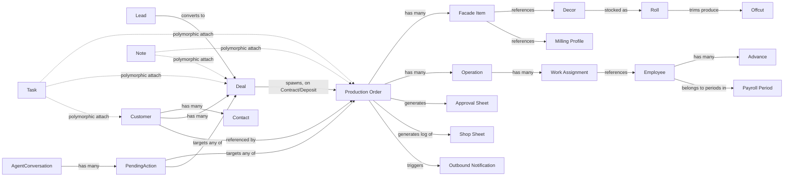

# Canonical Domain Architecture
## AI Furniture Manufacturing Operating System — incl. KORKEM Flow

Version: 2.0 — **Canonical. Single source of truth for all future implementation.**
Supersedes v1.0 (the initial ERPNext/CRM/Relaticle-only draft, preserved below in §16 as a review note, not a separate document).

No code was written or modified to produce this document, per the Critical Rule in `docs/archive/research/master_execution_prompt.md`.

**Sources merged**: `docs/archive/research/report_erpnext.md` (deep), targeted domain-model research on Frappe CRM and Relaticle (folded into v1.0 and carried forward here), and `docs/product/korkem_flow_spec.md` (the approved product specification). Where a claim traces to a specific source repo it is cited; where this document introduces a **new** entity not found in any source (required to satisfy the KORKEM spec), it is marked **(new)** and justified in §3's rationale column.

---

## 0. How to read this document

Sections map directly to the 20 requirements of the canonical-architecture request:

| § | Content | Req # |
|---|---|---|
| 1 | Bounded Contexts | 7 |
| 2 | Ownership Map | 4 |
| 3 | Entity Catalog (with existence rationale) | 1, 19 |
| 4 | Deduplication & Merge Decisions | 2, 3 |
| 5 | Aggregate Roots | 5 |
| 6 | Value Objects | 6 |
| 7 | Relationships | 10 |
| 8 | State Machines & Lifecycles | 8, 9 |
| 9 | Business Invariants | 11 |
| 10 | Validation Rules | 12 |
| 11 | Domain Events | 13 |
| 12 | Commands | 14 |
| 13 | Queries | 15 |
| 14 | Permissions | 16 |
| 15 | AI Responsibilities | 17 |
| 16 | Automation Opportunities | 18 |
| 17 | Rejected Entities & Non-Goals | 20 |
| 18 | Open Questions (evidence gaps, not guesses) | — |
| 19 | Self-Review Notes (v1.0 → v2.0) | — |

---

## 1. Bounded Contexts

Eight contexts. Two (**Collaboration**, **Identity & Access**) are shared kernels used by every other context rather than siloed domains.

1. **Sales & Relationship** — Lead, Deal, Customer, Contact. Owner: Frappe CRM.
2. **Manufacturing** — Production Order, Operation, BOM, Facade Item, Color Group, Milling Profile. Owner: ERPNext, extended.
3. **Materials & Warehouse** — Item, Decor, Roll, Offcut, Supplier, Warehouse, Stock Entry. Owner: ERPNext, extended.
4. **Workforce & Payroll** — Employee, Role, Work Assignment, Bonus Rule, Advance, Defect Penalty, Payroll Period. Owner: new KORKEM extension (deliberately decoupled from ERPNext's optional HR module — see §17).
5. **Collaboration** *(shared kernel)* — Task, Note. Owner: Frappe framework native pattern, as proven identically by Frappe CRM.
6. **AI & Automation** — Agent Conversation, Agent Message, Pending Action, AI Credit Ledger. Owner: Relaticle's `packages/Chat` pattern, reused platform-wide.
7. **Documents & Client Communication** — Approval Sheet, Shop Sheet (print log), Outbound Notification. Owner: new KORKEM extension.
8. **Identity & Access** *(shared kernel)* — User, Pin Credential, Role/Permission. Owner: Frappe framework native RBAC, extended with a PIN front-end.

## 2. Ownership Map

| Context | Primary owner | Reuse mechanism |
|---|---|---|
| Sales & Relationship | Frappe CRM (`CRM Lead`, `CRM Deal`, `CRM Organization`) | Existing CRM→ERPNext sync (`create_customer_in_erpnext`) extended, not rebuilt |
| Manufacturing | ERPNext (`Work Order`, `BOM`, `Job Card`, `Operation`) | Custom Fields + one new child Doctype (`Facade Item`) on top of `Work Order` |
| Materials & Warehouse | ERPNext (`Item`, `Warehouse`, `Stock Entry`) | `Decor` = `Item` subtype (`item_group="Decor"` + custom fields); `Roll`/`Offcut` = new child doctypes referencing `Item`/`Stock Entry` |
| Workforce & Payroll | New (KORKEM extension) | Lightweight custom doctypes on the same Frappe bench — not ERPNext HR (unconfirmed/out of scope, see §17) |
| Collaboration | Frappe framework (`reference_doctype`+`reference_docname` pattern) | Reuse `CRM Task`/`FCRM Note` doctypes as-is, extend their target-doctype list to include `Work Order` |
| AI & Automation | Relaticle (`packages/Chat`) — pattern reused, re-implemented on the Frappe bench (not a Laravel dependency) | New doctypes mirroring `PendingAction`'s shape (`action_class`, `action_data`, `display_data`, `status`) |
| Documents & Client Communication | New (KORKEM extension) | New doctypes; Excel/PDF generation via server-side report/print-format mechanisms already native to Frappe |
| Identity & Access | Frappe framework (`User`, role-based permissions, `permlevel`) | PIN login resolves to a real Frappe session server-side — no parallel auth system |

## 3. Entity Catalog

Format: **Entity** — *source* — one-line existence rationale.

### Sales & Relationship
- **Customer** — Frappe CRM `CRM Organization`, mirrored to ERPNext `Customer` — *exists because every Deal and Production Order needs a stable party to bill and communicate with; already solved by the live CRM↔ERPNext bridge.*
- **Contact** — core Frappe `Contact` — *exists because a Customer often has multiple people (owner, site manager, accountant); reused as-is since CRM and ERPNext already share it natively.*
- **Lead** — `CRM Lead` — *exists to capture pre-qualified interest before committing to the Deal/quotation effort; matches `PROJECT.md`'s "Lead → Customer Qualification" opening stage.*
- **Deal** — `CRM Deal` — *exists as the sales-side negotiation record (quotation, pricing, probability) up to the point a contract/deposit is secured; distinct from Production Order because a Deal can be lost/renegotiated without ever touching manufacturing.*

### Manufacturing
- **Production Order** — ERPNext `Work Order`, extended — *the platform's core entity per `PROJECT.md` §"Primary Object"; everything downstream (materials, labor, documents) references it.*
- **Operation** — ERPNext `Job Card`/`Routing Operation` — *exists to break a Production Order into schedulable, assignable units of work (one per machine/stage), matching KORKEM's stage checkboxes.*
- **BOM** — ERPNext `BOM`, reused as-is — *exists for orders that need a formal bill-of-materials explosion (e.g. standard cabinet lines); coexists with the lighter-weight Facade Item list rather than replacing it.*
- **Facade Item (new)** — *KORKEM needs a line-item per physical facade panel (product type, H×W×Th, qty, m²) that is lighter than a full BOM explosion and carries facade-specific attributes (decor, milling, edge) a generic BOM Item doesn't have. Modeled as a child doctype of Production Order, analogous to `Work Order Item` but facade-specialized — not a duplicate of BOM Item, since BOM Item describes a *recipe*, Facade Item describes an *ordered physical piece*.*
- **Color Group** — value object, see §6 — *not a separate entity; see §17 for why it was rejected as one.*
- **Milling Profile (new, lightweight reference)** — *exists because milling patterns/codes recur across orders and benefit from autocomplete/reuse, same as Decor; kept intentionally small (name, code) rather than a rich entity.*

### Materials & Warehouse
- **Item** — ERPNext `Item`, reused as-is — *the base material/product catalog; already bridged to `CRM Product`.*
- **Decor (new, Item subtype)** — *KORKEM's PVC film/MDF decors need supplier, thickness, cost/m, and consumption-tracking attributes beyond generic Item fields. Modeled as an `Item` with `item_group="Decor"` plus custom fields — not a parallel catalog, to avoid the exact duplication the reuse-first rule warns against.*
- **Roll (new)** — *a Decor is stocked in discrete rolls (linear meters, intake cost, supplier lot); exists to support the spec's dual-unit (m / m²) tracking and per-roll restock threshold, which a single aggregate stock-qty on Item can't express.*
- **Offcut (new)** — *usable leftover material (L×W mm) has resale/reuse value in this business and must be tracked separately from scrap, per the spec's "деловой отход" requirement.*
- **Supplier**, **Warehouse**, **Stock Entry** — ERPNext, reused as-is.

### Workforce & Payroll
- **Employee (new, lightweight)** — *shop-floor workers (name, PIN, active roles) must exist as a stable entity to assign work and pay bonuses to; deliberately NOT built on ERPNext's HR module — see §17 for why.*
- **Role (new, lightweight reference)** — *exists because the spec requires both fixed roles (Router/Sander/Vacuum/Painter/Packer) and arbitrary custom roles typed by the admin, and one worker can hold several — a fixed enum can't satisfy this, but a full HR "Designation" doctype would be overkill.*
- **Work Assignment (new)** — *exists specifically to record the 2–5-way percentage/area split the spec requires (e.g. Azamat 30%, Vova 40%, Semen 30%) — this data doesn't fit on a generic Task (no split semantics) or directly on Operation (which needs to support multiple simultaneous assignees).*
- **Bonus Rule (new, lightweight reference)** — *encodes daily/monthly thresholds → bonus amount, so thresholds are configurable data, not hardcoded logic.*
- **Advance (new)** — *cash given to a worker ahead of payroll must be tracked and later deducted; a plain ledger entry, not a complex accounting document.*
- **Defect Penalty (new)** — *deductions for defective work need the same traceability as bonuses — modeled symmetrically to Bonus Rule/Advance rather than as an ad hoc negative adjustment.*
- **Payroll Period (new)** — *exists to close a period (custom range, half-month, month, year) and compute `Total Earned − Advances − Penalties = Payable`, exportable to PDF/Excel per the spec.*

### Collaboration (shared kernel)
- **Task** — `CRM Task` pattern, reused as-is, target-doctype list extended — *generic to-do/follow-up item attachable to any entity; already solved once by CRM, reused rather than rebuilt (see §4).*
- **Note** — `FCRM Note` pattern, reused as-is, same extension — *free-text annotation attachable to any entity.*

### AI & Automation
- **Agent Conversation** — Relaticle `AgentConversation` pattern — *the container for one AI chat thread with a user.*
- **Agent Message** — Relaticle `AgentConversationMessage` pattern — *individual turns within a conversation.*
- **Pending Action** — Relaticle `PendingAction` pattern, generalized — *exists because `PROJECT.md`'s "Humans supervise, AI operates" principle requires every AI-proposed write to be inspectable and reversible before it happens; this is the one subsystem among all four source repos that already solves exactly that, and it already generalizes (`entity_type`, `action_class`, `action_data`) to any entity in this catalog without modification.*
- **AI Credit Ledger** — Relaticle `AiCreditBalance`/`AiCreditTransaction` pattern — *usage metering; kept optional for a single-tenant KORKEM deployment but preserved in the model since `PROJECT.md`'s Long-Term Expansion implies eventual multi-tenant use.*

### Documents & Client Communication
- **Approval Sheet (new)** — *the spec's 1-click Excel approval document with a signature block needs its own status (Draft/Sent/Signed) so a client's approval is a traceable event, not just a downloaded file.*
- **Shop Sheet (print log, new)** — *modeled as a lightweight generated-document log (what was printed, when, for which Production Order) rather than a heavy entity — see §17 for why it isn't richer than that.*
- **Outbound Notification (new)** — *a log of WhatsApp (and future channel) messages tied to Production Order status changes, needed for traceability ("did the client actually get notified?") per `PROJECT.md`'s auditability principle.*

### Identity & Access (shared kernel)
- **User** — core Frappe `User`, reused as-is.
- **Pin Credential (new, thin)** — *maps a 4-digit PIN to an existing Employee/User for the shop-floor login screen; deliberately thin — it resolves to a normal Frappe session, it is not a parallel identity system (see §17).*
- **Role/Permission** — Frappe framework native RBAC, reused as-is (confirmed generic and stable in `report_erpnext.md`).

## 4. Deduplication & Merge Decisions

| Concept | Appeared in | Decision |
|---|---|---|
| Customer/Organization/Company | ERPNext `Customer`, CRM `CRM Organization`, Relaticle `Company` | **Merge into one**: CRM `CRM Organization`, synced to ERPNext `Customer` via the existing bridge. Relaticle's `Company` rejected (redundant, §17). |
| Contact/Person | core Frappe `Contact`, Relaticle `People` | **Merge into one**: core Frappe `Contact`. Relaticle's `People` rejected (redundant, §17). |
| Deal/Opportunity | CRM `CRM Lead`+`CRM Deal`, Relaticle `Opportunity` | **Merge into CRM's two-stage Lead→Deal model** — maps more precisely onto `PROJECT.md`'s multi-stage pre-production lifecycle than Relaticle's single-stage Opportunity. |
| Task | CRM `CRM Task`, Relaticle `Task` | **Merge into CRM's Frappe-native polymorphic Task** (`reference_doctype`/`reference_docname`) — same pattern as Relaticle's `morphToMany`, but Frappe-native and already shared with ERPNext. |
| Note | CRM `FCRM Note`, Relaticle `Note` | Same merge logic as Task. |
| Product/Material | ERPNext `Item`, CRM `CRM Product` | **Merge into ERPNext `Item`** — CRM Product↔Item sync already exists; KORKEM's `Decor` is a further subtype of `Item`, not a third catalog. |
| AI action-proposal mechanism | none in ERPNext/CRM; Relaticle `PendingAction` | **Single source: Relaticle's pattern**, generalized to every context in this catalog rather than staying CRM-scoped. |
| Custom Fields | Frappe native Custom Field, Relaticle's separate `relaticle/custom-fields` Composer package | **Not merged** — tied to different runtimes; the platform uses Frappe's native mechanism throughout (it's the framework this platform is built on), Relaticle's package is not applicable outside Laravel. |

## 5. Aggregate Roots

| Aggregate Root | Contains (owned) | Referenced (not owned) |
|---|---|---|
| **Customer** | Contact(s) | Deal(s), Production Order(s) — referenced, not owned, so CRM-side edits don't cascade into manufacturing history |
| **Deal** | — (standalone until conversion) | Customer, Contact |
| **Production Order** | Facade Item(s), Operation(s), Work Assignment(s) *(via Operation)*, Task(s)/Note(s) *(polymorphic attach)*, Approval Sheet(s), Shop Sheet log entries, Outbound Notification log entries | Customer, originating Deal, Decor(s) *(via Facade Item)*, Employee(s) *(via Work Assignment)* |
| **Decor** (an `Item` subtype) | Roll(s) | — |
| **Employee** | Advance(s), Payroll Period line entries | Work Assignment(s) *(referenced from Production Order side)* |
| **Payroll Period** | per-employee payroll lines (earned, advances, penalties, payable) | Employee, Bonus Rule, Advance, Defect Penalty |
| **Agent Conversation** | Agent Message(s), Pending Action(s) | whatever entity each Pending Action targets (`entity_type`) |

Cross-cutting, not owned by any single aggregate: **Task**, **Note** (attach polymorphically to any of the above).

## 6. Value Objects

Immutable, no independent identity or lifecycle:

- **Money** (amount + currency ₸)
- **Area** (m², always derived as `Σ Facade Item area` for a Production Order — never stored independently, see §9)
- **Dimensions** (H × W × Thickness, mm)
- **Percentage** (0–100, used in Work Assignment splits)
- **Client Tier** (New | Regular | VIP — an attribute of Customer, not a separate entity)
- **Urgency Level** (Normal | Urgent — an attribute of Production Order)
- **Edge Profile** (controlled list: R3, 90°, … — deliberately a value object, not a full reference entity; see §17)
- **Color Group / Color Tag** (a label + swatch, either auto-derived from a Facade Item's Decor or manually overridden — see §17 for why this stays a value object)
- **Work Split** (worker reference + Percentage or Area — the shape of one row inside a Work Assignment)
- **Date Range** (used identically across the Client Analytics and Payroll period filters: Today / This Week / This Month / custom / half-month / year)
- **Phone Number**, **Address** — standard contact-detail value objects.

## 7. Relationships

## 8. State Machines & Lifecycles

### 8.1 Deal
`New → Qualified → Quoted → (Won → converts to Production Order) | Lost`
Mirrors CRM's Link-based `CRM Deal Status` (Open/Ongoing/On Hold/Won/Lost, with kanban `position`/`color`), reused as-is.

### 8.2 Production Order — macro lifecycle (canonical, unchanged from `PROJECT.md`)
`Lead → Customer Qualification → Measurement → Room Photos → Design → Revision → Customer Approval → Quotation → Contract → Deposit → Material Planning → Inventory Validation → Purchasing → Supplier Confirmation → Material Arrival → Warehouse Allocation → Production Planning → Cutting → Edge Banding → CNC → Drilling → Painting → Assembly → Quality Inspection → Packaging → Delivery Planning → Delivery → Installation → Acceptance → Warranty → Archive`

### 8.3 Production Order — shop-floor sub-state (KORKEM's realization of the "Cutting…Packaging" segment above)
`Not Started → Cutting/Кесу → Router/Фреза → Sanding/Шкурка → Vacuum/Вакуум → Paint/Бояу → Ready/Аяқталды → Packaged`
Tracked per Facade Item/Operation, rolled up to a Production Order-level progress view (KORKEM's stage checkboxes). A Production Order cannot advance to `Ready` in the macro lifecycle until every Facade Item's sub-state reaches `Ready` (see invariant in §9).

### 8.4 Pending Action
`Pending → Approved | Rejected | Expired` (matches Relaticle's `isPending()`/`isExpired()` semantics exactly).

### 8.5 Approval Sheet
`Draft → Sent → Signed | Expired`

### 8.6 Payroll Period
`Open → Closed → Paid`

## 9. Business Invariants

1. A Production Order's total area is always `Σ Facade Item.area` — never stored/edited independently (prevents the exact "duplicate data" failure `PROJECT.md` §"Data Philosophy" warns against).
2. A Production Order cannot reach macro-lifecycle `Ready`/`Packaging` until **every** Facade Item's shop-floor sub-state (§8.3) is `Ready`.
3. A Work Assignment's splits must sum to exactly 100% (percentage mode) or to the Operation's total area (area mode) — partial splits are invalid, not silently allowed.
4. A Deal converts to **at most one** Production Order; a Production Order references **zero or one** originating Deal (walk-in/direct orders may have none).
5. A Roll's remaining linear meters can never go negative; consumption is deducted at the point a Facade Item's material is committed (Cutting stage start), not at order creation.
6. A Customer's Client Tier is either system-computed (from order history/value) or manually overridden — never silently both; an override must be explicit and recorded (who/when), not just a flipped flag.
7. Urgent Production Orders must sort ahead of non-urgent ones in every production-queue view — an invariant on the Query layer (§13), not just a UI filter.
8. A Shop Sheet's rendered output must never include Money-valued fields — enforced at generation time, not left to print-template discipline alone.
9. A Pending Action must be re-validated against current entity state at approval time, not just at proposal time (prevents acting on a stale proposal if the underlying entity changed in between).
10. An Advance can only be issued against an existing, active Employee, and reduces that Employee's Payable in the Payroll Period covering its date.

## 10. Validation Rules

- Facade Item dimensions (H, W, Th) must be > 0; quantity ≥ 1.
- Work Assignment percentages: each ≥ 0 and ≤ 100; sum across one Operation's assignments == 100 (percentage mode).
- Roll linear meters and Offcut dimensions must be ≥ 0.
- Restock threshold (e.g. 15 m) must be ≥ 0; a Roll below threshold is flagged, never blocked from use.
- Pin Credential: exactly 4 digits, unique among currently-active Employees (reuse after deactivation is allowed).
- Decor code must be unique per Supplier.
- Phone numbers validated to a standard format before Customer/Contact save.
- Bonus Rule thresholds must be monotonically increasing if multiple tiers exist (no overlapping/contradictory thresholds).

## 11. Domain Events

`LeadCreated`, `LeadConverted`, `DealWon`, `DealLost`, `ProductionOrderCreated`, `ProductionOrderStageCompleted` (per Facade Item/Operation), `ProductionOrderReady`, `ProductionOrderArchived`, `MaterialConsumed`, `RollRestocked`, `RestockThresholdBreached`, `WorkAssignmentCompleted`, `BonusEarned`, `AdvanceIssued`, `DefectPenaltyRecorded`, `PayrollPeriodClosed`, `PendingActionProposed`, `PendingActionApproved`, `PendingActionRejected`, `ApprovalSheetGenerated`, `ApprovalSheetSigned`, `OutboundNotificationSent`.

## 12. Commands

`CreateLead`, `ConvertLeadToDeal`, `ConvertDealToProductionOrder`, `AddFacadeItem`, `AssignDecorToFacadeItem`, `AssignWorkersToOperation` (with split), `CompleteStage`, `MarkUrgent`, `SetClientTier`, `RecordPayment`, `GenerateApprovalSheet`, `SignApprovalSheet`, `GenerateShopSheet`, `SendOutboundNotification`, `RestockRoll`, `LogOffcut`, `IssueAdvance`, `RecordDefectPenalty`, `CloseBonlPayrollPeriod`, `ProposeAction` (AI-originated), `ApproveAction`, `RejectAction`.

## 13. Queries

`GetOrdersTable` (filters: urgent-first, VIP-only, status, compact/full view), `GetOrderDetail`, `GetClientStats` (period filter), `GetClientSummaryText`, `GetWarehouseStock` (low-stock-only toggle), `GetWorkerPayroll` (period filter), `GetBonusProgress` (per worker, "N m² left until bonus"), `GetPendingActions` (per user/team).

## 14. Permissions

| Role | Scope |
|---|---|
| Admin | Full access, all contexts |
| Sales / CRM user | Lead, Deal, Customer, Contact — full CRUD; Production Order — read-only |
| Production Manager | Production Order, Facade Item, Operation — full CRUD; Workforce — assign only |
| Workshop Operator (Router/Sander/Vacuum/Painter/Packer/custom) | Own assigned Operation/Work Assignment — update stage status only; no financial fields, no other orders |
| Warehouse Manager | Decor, Roll, Offcut, Item, Stock Entry — full CRUD |
| Accountant / Payroll | Payroll Period, Advance, Defect Penalty — full CRUD; Production Order — read-only, no edit |
| AI Agent | **Never direct write** — may only create Pending Actions; a human role above approves/rejects |

Matches ERPNext's confirmed native RBAC model (role + per-doctype permission + `permlevel` field-level tier, per `report_erpnext.md`) — no new permission engine needed.

## 15. AI Responsibilities

Mapped from `PROJECT.md`'s AI Agents list onto this catalog — every action below is mediated through Pending Action, never a direct write:

- **Production Agent** — monitors Production Order stage delays, proposes re-sequencing.
- **Warehouse Agent** — monitors Roll restock thresholds, proposes purchase/restock actions.
- **Sales Agent** — qualifies Leads, drafts Deal quotations.
- **Planning Agent** — suggests Work Assignment splits based on worker load/history.
- **Finance Agent** — computes Bonus Rule outcomes, flags Payroll Period anomalies.
- **Quality Agent** — flags Defect Penalty candidates from stage-completion notes.
- **Supervisor Agent** — reviews other agents' proposals before they reach a human approver (a second, AI-side check upstream of the human Pending-Action approval — not a bypass of it).

## 16. Automation Opportunities

Auto Color Group derivation from Facade Item's Decor (manual override always wins); auto Bonus computation against Bonus Rule thresholds; auto Outbound Notification trigger on reaching `Ready`; auto Restock threshold flagging; auto Client Tier recomputation from order history; auto Approval Sheet / Shop Sheet generation on request; auto `originating_deal` linkage when a Deal converts, so the Production Order never needs manual re-entry of Customer/Contact data.

## 17. Rejected Entities & Non-Goals

- **Relaticle's `Company`/`People`/`Opportunity`** — rejected as canonical Customer/Contact/Deal. CRM already owns this and already bridges to ERPNext; adopting Relaticle's versions would be a third redundant implementation of the same concept, directly against the Primary Rule.
- **A separate Pipeline/Stage entity** distinct from CRM's Link-based `CRM Deal Status` — rejected; the existing Link+`position`/`color` fields already give kanban ordering without a new entity.
- **Edge Profile as a full reference doctype** — rejected in favor of a value object/controlled list; cardinality is tiny (R3, 90°, a handful of others) and it never needs independent lifecycle (audit history, stock, supplier) the way Decor does.
- **Color Group as a persistent entity** — rejected in favor of a value object computed from Decor (or manually overridden inline on the Facade Item). It has no independent lifecycle of its own; making it an entity would just be indirection over "a label plus a swatch."
- **Shop Sheet as a rich entity** — rejected in favor of a thin generated-document log. The printed artifact itself is a rendering of a Production Order snapshot at print time; only the fact-of-printing needs persisting for traceability, not a parallel document model.
- **A parallel authentication system for PIN login** — rejected. Pin Credential is a thin lookup that resolves to a normal Frappe session; building a separate session/token system would duplicate exactly what Identity & Access already provides.
- **Full ERPNext HR/Payroll module as the Employee/Payroll owner** — rejected for this milestone. The vendored `erpnext/` snapshot's HR module presence was never confirmed (flagged as an open question since v1.0), and ERPNext HR is scoped for full statutory payroll compliance — heavier than KORKEM's shop-floor bonus/advance tracking needs. Building a lightweight, KORKEM-scoped Employee/Payroll subsystem now avoids both guessing that HR exists and prematurely taking on its complexity; if ERPNext HR is confirmed present later, reconciling the two (rather than running both) becomes a deliberate follow-up decision, not a default.
- **Event-sourcing / full CQRS infrastructure** — rejected as a build target. The Commands/Events/Queries in §11-13 are a *modeling* tool (they sharpen the API/permission surface), not a mandate to stand up a message bus or event store; Frappe's existing change-tracking (`track_changes`, doc versions, Comments) already provides the auditability `PROJECT.md` asks for.
- **ERPNext Projects module as part of this canonical model** — deferred, not rejected outright. Confirmed present in the folder tree but not deep-scanned; KORKEM's flow doesn't require multi-order project grouping for its 9 specified modules, so it's out of scope until a real need appears.

## 18. Open Questions (evidence gaps carried forward, not guessed)

1. **Employee/HR module presence in the vendored `erpnext/` snapshot** — unresolved since v1.0; resolved *architecturally* by decoupling (§17), but the underlying fact is still unverified.
2. **Schedule/Event entity** — `PROJECT.md` lists "Scheduling" as a module; Frappe framework is expected to ship a generic `Event`/calendar doctype, but this was not directly confirmed in either research pass on this specific clone. Delivery/Installation appointment scheduling (KORKEM doesn't explicitly ask for this yet) would need this verified before design.
3. **ERPNext Projects module detail** — deferred per §17, would need its own targeted research pass if a future milestone needs it.

## 19. Self-Review Notes (v1.0 → v2.0)

Per the instruction to review, find inconsistencies, and repeat until none remain — findings from this pass:

1. **Resolved**: v1.0 left "Employee" as a fully open blocker with no path forward. v2.0 resolves it architecturally (decouple from ERPNext HR, build lightweight) rather than leaving it stalled — the underlying evidence gap (§18.1) is carried forward honestly, but it no longer blocks design.
2. **Checked for new duplication introduced by KORKEM**: KORKEM's "Client Tier" (VIP/Regular/New) maps onto the existing Customer entity as an attribute — confirmed **not** a new Customer model. KORKEM's "Urgent" flag maps onto Production Order as an attribute — confirmed **not** a new Order entity parallel to Work Order.
3. **Checked Work Assignment vs. Task overlap**: confirmed these are deliberately distinct — Work Assignment carries structured percentage/area split data Task has no room for; Task remains the generic polymorphic to-do. Not a duplicate.
4. **Checked Pending Action generalization**: confirmed its existing shape (`entity_type`, `action_class`, `action_data`, `display_data`) already covers Production Order and Payroll Period actions without redesign — no new fields required.
5. **Checked cross-context reference integrity**: Decor lives in Materials & Warehouse (ERPNext-owned) while being referenced heavily from Facade Item in Manufacturing — confirmed this is a plain cross-context Link reference, consistent with how Item references already work; not a modeling conflict.
6. **Checked KORKEM didn't silently get its own bounded context**: deliberately folded KORKEM-specific entities (Facade Item, Decor extension, Work Assignment, Payroll Period, Approval Sheet, etc.) into the existing eight contexts rather than creating a ninth "KORKEM" context — keeps the model general (per `PROJECT.md`'s furniture → wood → metal → construction expansion goal) rather than client-specific.

No unresolved architectural conflicts remain as of this version. Two evidence gaps remain open (§18) but are not conflicts — they are flagged dependencies for later verification, consistent with "never guess, investigate."

---

*Per the Stop Condition in `docs/archive/research/master_execution_prompt.md`: this is the canonical domain architecture milestone, documentation only, no code/schema changes made. Stopping here for approval.*
