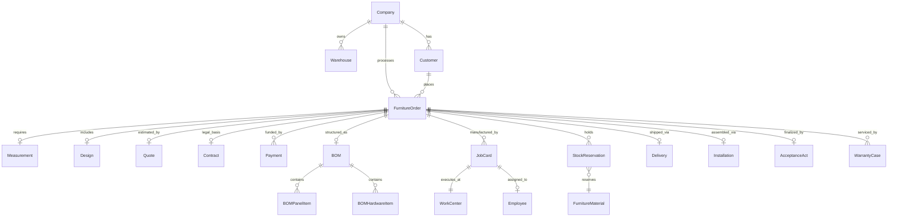

# Каноническая доменная модель мебельного производства KORKEM v2 (Canonical Domain Model)

**Дата:** 2026-09-16  
**Версия:** 2.0  
**Статус:** Нормативная спецификация предметной области (DDD)  
**Базис:** Синтез ERPNext (Manufacturing/Stock), Odoo (Double-entry inventory), Twenty (Metadata/Timeline) и мебельной практики KORKEM.

---

## 1. Фундаментальные принципы домена

1. **Строгая принадлежность организации (Tenant Ownership):**
   Каждая доменная сущность (кроме системных справочников ролей и единиц измерения) содержит обязательное индексированное поле `company_id`. Отсутствие компании при создании записи недопустимо.
2. **Иммутабельность финансового и складского учета (Append-Only Ledgers):**
   Движение денег (`Payment`) и движение материалов (`StockMovement`) никогда не обновляются «по месту» (`UPDATE`) задним числом. Любая корректировка оформляется сторнирующей (компенсирующей) проводкой.
3. **Мягкое удаление (Soft Delete):**
   Бизнес-документы (Заказы, Замеры, Сметы, Чертежи) не удаляются физически (`DELETE`). Они переводятся в статус `CANCELLED` или помечаются `is_deleted = 1` с обязательной фиксацией причины отмены в аудит-логе.
4. **Специфика индивидуального производства (ETO — Engineer-to-Order):**
   В отличие от серийного завода, в мебельном цехе каждое изделие создается под уникальные размеры помещения клиента. Спецификация (BOM) рождается динамически из файла БАЗИС XML или расчета замерщика.

---

## 2. Реестр канонических сущностей (Entity Registry)

### 2.1 Организация и персонал (Organization & Staff)
- **`Company`:** Юридическое лицо цеха, валюта учета (KZT), адрес производства, реквизиты.
- **`Warehouse`:** Место хранения (Склад плитных материалов, Склад кромки, Склад фурнитуры, Сборочный цех, Зона брака).
- **`Employee`:** Сотрудник, ФИО, телефон, привязка к системному `User`, должность/роль.
- **`Role`:** Шаблон прав (OWNER, DIRECTOR, ADMINISTRATOR, MEASURER, DESIGNER, PRODUCTION_MANAGER, CUTTING_OPERATOR, EDGEBANDING_OPERATOR, CNC_OPERATOR, ASSEMBLER, INSTALLER, DRIVER).

### 2.2 Клиенты и коммерческий блок (Commercial & CRM)
- **`Customer`:** Физическое или юридическое лицо, имя, телефон (WhatsApp), адрес, история заказов, баланс.
- **`Lead / Enquiry`:** Обращение клиента с мессенджера/звонка. Статусы: `NEW -> QUALIFIED -> CONVERTED / LOST`.
- **`Measurement`:** Заказ на замер. Дата и слот времени, адрес, замерщик, статус (`SCHEDULED -> IN_PROGRESS -> COMPLETED -> CANCELLED`).
- **`MeasurementPoint`:** Конкретные размеры (Длина стен, высота до потолка, перепады уровня пола, углы в градусах).
- **`PhotoAttachment`:** Фотографии розеток, газовых труб, стояков, радиаторов с удаленным EXIF и приватным доступом.
- **`Design`:** 3D-проект или файл БАЗИС-Мебельщик. Версии чертежа (`DesignRevision`).
- **`Quote / Estimate`:** Коммерческое предложение. Себестоимость сырья + операции + наценка + монтаж/доставка.
- **`Contract`:** Договор с клиентом, сумма, график оплат, интеграция с TrustMe.
- **`Payment`:** Факт внесения денег (Kaspi / Касса). Типы: `DEPOSIT (50%)`, `MILESTONE (40%)`, `FINAL (10%)`.

### 2.3 Мебельные материалы и комплектующие (Catalogue & Materials)
- **`FurnitureMaterial`:** Базовая номенклатура. Категории: Плита (ЛДСП/МДФ/ХДФ), Кромка, Пленка, Фасад, Столешница.
- **`PanelItem`:** Плитный материал. Атрибуты: производитель (Egger, Lamarty, Kastamonu), декор, толщина (10, 16, 18, 22, 25 мм), длина (2800 мм), ширина (2070 мм), направление текстуры (Grain direction).
- **`EdgeItem`:** Кромочный материал. Толщина (0.4, 0.8, 1.0, 2.0 мм), ширина (19, 22, 28, 42 мм), декор.
- **`FurnitureHardware`:** Фурнитура. Петли (с доводчиком/без), направляющие (шариковые, скрытого монтажа, тандембоксы), подъемники, конфирматы, эксцентрики, ручки.

### 2.4 Мебельный заказ и производство (Order & Manufacturing)
- **`FurnitureOrder`:** Главный объект системы (Order Lifecycle Root). Привязка к клиенту, договору, дате монтажа.
- **`BOM (Bill of Materials)`:** Спецификация изделия, сгенерированная из БАЗИС XML.
  - `BOMPanelItem`: панель (наименование: «Боковина левая», декор, чистовой размер ДхШ, присадки, кромление по 4 сторонам: L1, L2, W1, W2).
  - `BOMHardwareItem`: фурнитура под изделие (петли 4 шт, направляющие 3 комплекта).
- **`WorkCenter / Workstation`:** Производственный участок:
  1. Форматно-раскроечный / ЧПУ раскрой (Nesting);
  2. Кромкооблицовочный станок;
  3. Сверлильно-присадочный станок / ЧПУ присадка;
  4. Фрезерный станок (фасады МДФ);
  5. Мембранно-вакуумный пресс (накатка пленки ПВХ);
  6. Сборочный пост;
  7. Упаковочный стол.
- **`JobCard / ShiftTask`:** Сменное задание оператора на конкретную операцию. Содержит перечень деталей, штрихкоды, плановое время и сдельную расценку (KZT/м² или KZT/деталь).

### 2.5 Склад и движение запасов (Inventory & Movements)
- **`StockLot / StockBalance`:** Остаток материала на конкретном складе.
- **`StockOffcut (Деловой остаток)`:** Пригодный для дальнейшего использования обрезок плиты (Длина >= 500 мм, Ширина >= 300 мм, декор, номер ячейки хранения).
- **`StockReservation`:** Зарезервированное сырье под конкретный `FurnitureOrder` (не может быть списано в другой заказ).
- **`StockMovement`:** Двусторонняя проводка: `from_warehouse -> to_warehouse, qty, reason`.

### 2.6 Логистика, монтаж и гарантия (Delivery & Warranty)
- **`Delivery`:** Доставка готовой мебели клиенту. Маршрутный лист, упаковки, водитель, отметка сдачи.
- **`Installation`:** Выездная сборка бригадой монтажников. Чек-лист проверки (ровность навески, зазоры фасадов, подключение подсветки).
- **`AcceptanceAct`:** Акт приема-передачи, подписанный заказчиком (с фото установленной мебели).
- **`WarrantyCase`:** Рекламация клиента (брак петли, провисание фасада, дефект столешницы). Срок гарантии, мастер, стоимость устранения.

### 2.7 Платформа и безопасность (Platform & Audit)
- **`AuditEvent`:** Неизменяемая запись о любом действии в системе (actor, timestamp, event, diff).
- **`DomainOutboxEvent`:** Гарантированная очередь событий для асинхронной доставки.
- **`AutomationRule & AutomationRun`:** Правила пользовательской автоматизации цеха.

---

## 3. Схема реляционных связей (ER-Диаграмма связей)

---

## 4. Доменные инварианты и бизнес-правила

1. **Инвариант раскроя:** Площадь чистовых деталей в BOM не может превышать общую площадь зарезервированных плит с учетом технологического процента отходов (waste factor).
2. **Инвариант резервирования:** Материалы под заказ могут быть переведены в статус `RESERVED` только после получения подтвержденного аванса (`Payment` со статусом `CONFIRMED` на сумму >= 50% от сметы).
3. **Инвариант отгрузки:** Мебель не может быть отгружена (`Delivery`), пока все сменные задания (`JobCard`) по заказу не перейдут в статус `COMPLETED` и отдел ОТК не подтвердит качество.
4. **Инвариант монтажа:** Монтаж не может быть начат до момента фактической доставки мебели на адрес клиента.
5. **Инвариант закрытия заказа:** Заказ переходит в статус `COMPLETED` только при одновременном наличии подписанного Акта приема-передачи (`AcceptanceAct`) и 100% закрытия финансового баланса (отсутствие дебиторской задолженности).
