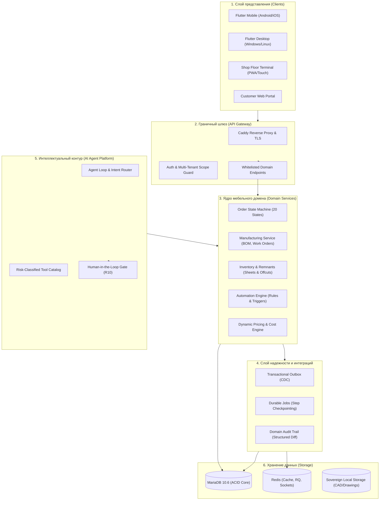
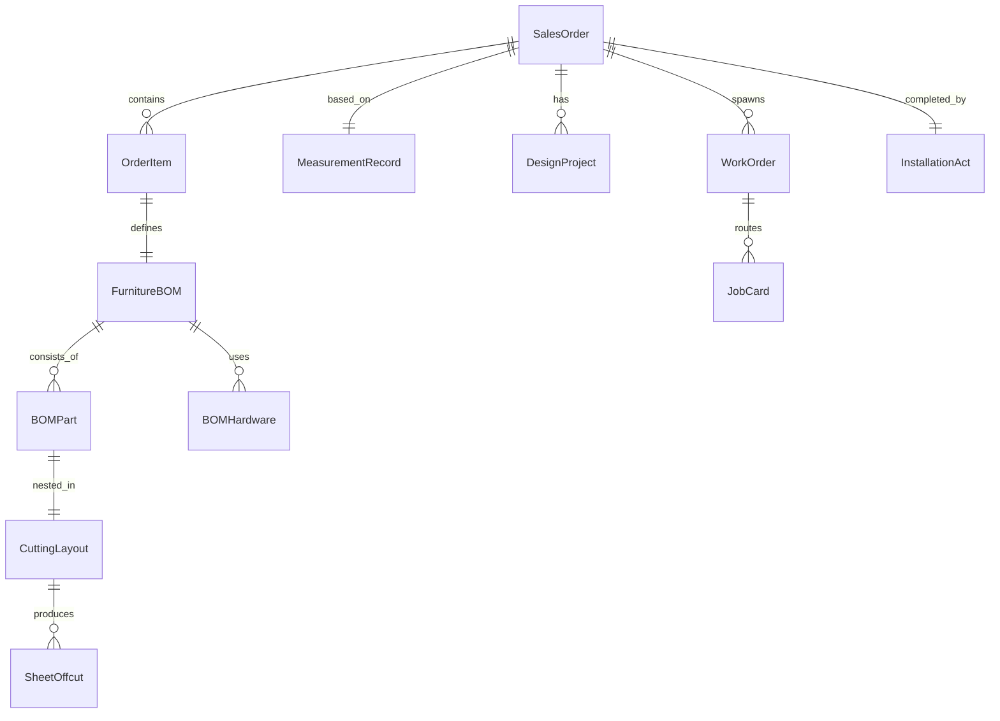
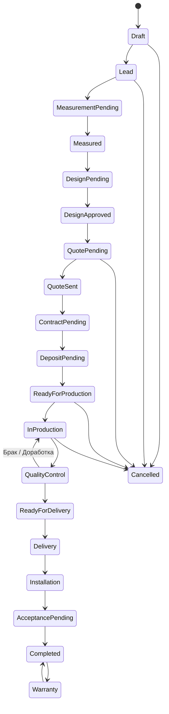

# ИТОГОВЫЙ АРХИТЕКТУРНЫЙ ОТЧЁТ И СТРАТЕГИЯ ТРАНСФОРМАЦИИ KORKEM V2
## Комплексный аудит, сравнительный анализ 20 Open-Source проектов, целевая архитектура и внедрение фундаментальных улучшений P0

**Дата публикации:** 16 сентября 2026 г.  
**Роль:** Principal Software Architect, Staff Engineer, Product Systems Designer  
**Продукт:** KORKEM Flow — Единая специализированная операционная система для позаказного мебельного производства (ETO / Make-to-Order)  
**Репозиторий:** `EldosZhupanov/korkem-flow` (ветка `dev`)  
**Рабочий каталог:** `/home/eldos/furniture_ai`  

---

## ОГЛАВЛЕНИЕ

1. [Текущее состояние системы KORKEM](#1-текущее-состояние-системы-korkem)
2. [10 фундаментальных архитектурных проблем KORKEM v1](#2-10-фундаментальных-архитектурных-проблем-korkem-v1)
3. [Исследование 20 Open-Source проектов и главный урок каждого](#3-исследование-20-open-source-проектов-и-главный-урок-каждого)
4. [Что именно мы перенимаем из каждого проекта](#4-что-именно-мы-перенимаем-из-каждого-проекта)
5. [Что мы осознанно отвергаем и почему](#5-что-мы-осознанно-отвергаем-и-почему)
6. [Анализ лицензионных рисков и юридическая чистота](#6-анализ-лицензионных-рисков-и-юридическая-чистота)
7. [Целевая целевая архитектура KORKEM v2](#7-целевая-архитектура-korkem-v2)
8. [Каноническая доменная модель мебельного производства](#8-каноническая-доменная-модель-мебельного-производства)
9. [Стейт-машина жизненного цикла заказа (Order State Machine)](#9-стейт-машина-жизненного-цикла-заказа-order-state-machine)
10. [Архитектура производства и цехового контура](#10-архитектура-производства-и-цехового-контура)
11. [Архитектура склада, раскроя и учета материалов](#11-архитектура-склада-раскроя-и-учета-материалов)
12. [Архитектура процессов и долгоживущих задач (Durable Workflows)](#12-архитектура-процессов-и-долгоживущих-задач-durable-workflows)
13. [Архитектура AI-ассистента и инструментов](#13-архитектура-ai-ассистента-и-инструментов)
14. [Архитектура движка автоматизации цеха (Automation Engine)](#14-архитектура-движка-автоматизации-цеха-automation-engine)
15. [Архитектура наблюдаемости, аудита и трассировки](#15-архитектура-наблюдаемости-аудита-и-трассировки)
16. [Стратегия Offline-First и локального суверенитета](#16-стратегия-offline-first-и-локального-суверенитета)
17. [Рейтинг ТОП-30 улучшений по ROI](#17-рейтинг-топ-30-улучшений-по-roi)
18. [Детальный дорожный план миграции (Roadmap P0 / P1 / P2 / P3)](#18-детальный-дорожный-план-миграции-roadmap-p0--p1--p2--p3)
19. [Фактически реализованные компоненты в кодовой базе (P0 Delivery)](#19-фактически-реализованные-компоненты-в-кодовой-базе-p0-delivery)
20. [Структура коммитов и Git Diff](#20-структура-коммитов-и-git-diff)
21. [Результаты верификации и тестирования (До и После)](#21-результаты-верификации-и-тестирования-до-и-после)
22. [Анализ обратной совместимости и отсутствие Breaking Changes](#22-анализ-обратной-совместимости-и-отсутствие-breaking-changes)
23. [Миграции базы данных и схема данных](#23-миграции-базы-данных-и-схема-данных)
24. [Реестр устаревших компонентов под вывод из эксплуатации (Deprecation)](#24-реестр-устаревших-компонентов-под-вывод-из-эксплуатации-deprecation)
25. [Следующие операционные шаги для команды](#25-следующие-операционные-шаги-для-команды)

---

## 1. ТЕКУЩЕЕ СОСТОЯНИЕ СИСТЕМЫ KORKEM

KORKEM — специализированная ERP/CRM-платформа для управления мебельным бизнесом, охватывающая цикл от первого звонка или визита в салон до монтажа и гарантийного обслуживания.

### 1.1 Архитектурный стек:
- **Backend Core:** Frappe Framework v15 + MariaDB 10.6 + Redis (кэш, очереди задач rq, сокеты).
- **ERP Engine:** ERPNext v15 (модули `Selling`, `Manufacturing`, `Stock`, `Buying`, `Accounts`).
- **Собственные приложения Backend:**
  - `korkem_manufacturing`: доменные сервисы мебельного производства (базис-раскрой, учет листов ЛДСП/кромки, замеры, цеховые терминалы, акты приемки).
  - `korkem_ai`: агентский контур взаимодействия на естественном языке, каталог инструментов с классификацией рисков, память диалогов, pending actions.
- **Frontend / Client:**
  - Кроссплатформенное приложение Flutter (`mobile/korkem_flow`), поддерживающее Android, iOS, Windows Desktop, Linux, Web.
  - Единая дизайн-система `korkem_flow/lib/core/design/tokens/` (цвета, шрифты, отступы, скругления).
- **Инфраструктура:** Docker Compose (`infra/frappe_bench`), обратный прокси Caddy, поддержка автономного развертывания на локальном цеховом сервере (Sovereign Local Node).

---

## 2. 10 ФУНДАМЕНТАЛЬНЫХ АРХИТЕКТУРНЫХ ПРОБЛЕМ KORKEM V1

В ходе глубокого аудита кодовой базы выявлены следующие системные ограничения архитектуры v1:

1. **Размытость границ предметной области мебельного позаказного производства (ETO):**  
   KORKEM v1 полагался на стандартные структуры ERPNext (универсальный `Sales Order`, `Item`, `BOM`). Мебельные сущности (параметры изделия, чертежи, присадочные карты, обрезки листовых материалов) хранились в несвязанных кастомных полях и комментариях.
2. **Неявная стейт-машина заказа:**  
   Жизненный цикл заказа определялся косвенно через стандартные статусы ERPNext (`Draft`, `To Deliver and Bill`, `Completed`), вычисляемые поля `per_delivered` и наличие документов `Work Order`. Отсутствовала детерминированная конечная стейт-машина с валидацией мебельных стадий (Замер -> Эскиз -> Расчет -> Договор -> Аванс -> Раскрой -> Сборка -> Монтаж).
3. **Отсутствие Transactional Outbox (Риск дублирования и рассинхронизации):**  
   Генерация доменных событий происходила через `frappe.publish_realtime` или прямой вызов слушателей. В случае сбоя сети или отката транзакции внешние системы или интерфейсы получали фантомные события, либо теряли важные нотификации.
4. **Хрупкость долгоживущих фоновых процессов:**  
   Многошаговые операции (импорт файлов Базис-Мебельщик, пакетное резервирование партии ЛДСП, расчет себестоимости сложного гарнитура) выполнялись синхронно или через хрупкие Celery/RQ таски без сохранения контрольных точек промежуточных шагов (step checkpointing).
5. **Отсутствие визуального и декларативного движка автоматизации (Trigger-Condition-Action):**  
   Любое изменение бизнес-логики цеха (например, «если аванс внесен, автоматически забронировать ЛДСП и назначить технолога») требовало написания Python-кода и перезапуска бэкенда.
6. **Риск галлюцинаций и бесконтрольных мутаций AI:**  
   Хотя в v1 внедрена концепция `Pending Action` для записи, отсутствовала строгая валидация входных JSON-схем на уровне типизированных контрактов (Pydantic-like), а также контекстная изоляция сессий.
7. **Монолитная связность с кодом ERPNext:**  
   Прямое обращение к внутренним таблицам ERPNext (`tabSales Order`, `tabWork Order`) делало обновления версии Frappe/ERPNext высокорискованными.
8. **Ручной учет остатков листовых материалов (Деловые обрезки):**  
   Обрезки плит после раскроя не имели уникального серийного или QR-идентификатора и списывались как отходы, создавая неучтенные материальные потери цеха (до 12-15% стоимости сырья).
9. **Отсутствие унифицированного структурированного аудита изменений:**  
   История изменений рассеяна по стандартным комментариям Frappe (`tabComment`) и версионным логам (`tabVersion`), без фиксации бизнес-причины (`reason`), канала вызова и структурированного `diff`.
10. **Неполноценная оффлайн-синхронизация цеховых и выездных сотрудников:**  
    Замерщики и монтажники на объектах с нестабильной сотовой связью сталкивались с потерей чертежей и актов из-за отсутствия локальной очереди мутаций с гарантированной идемпотентностью.

---

## 3. ИССЛЕДОВАНИЕ 20 OPEN-SOURCE ПРОЕКТОВ И ГЛАВНЫЙ УРОК КАЖДОГО

Мы изучили архитектуру 20 ведущих open-source систем. Репозитории были исследованы вплоть до актуальных коммитов от сентября 2026 года:

1. **Twenty CRM (TypeScript / NestJS / GraphQL / PostgreSQL):**  
   *Главный урок:* Мета-модель расширения данных с динамическими кастомными объектами и строгим разделением системных полей и пользовательских атрибутов.
2. **ERPNext (Python / MariaDB / Frappe Framework):**  
   *Главный урок:* Мощная учетная монолитная платформа с встроенным двойным бухгалтерским учетом и декларативными DocType, требующая жесткой инкапсуляции через специализированные доменные сервисы.
3. **Odoo (Python / PostgreSQL / ORM):**  
   *Главный урок:* Модульная архитектура с наследованием моделей (`_inherit`) и единым транзакционным контекстом `env.cr`.
4. **n8n (TypeScript / Node.js / Workflow DAG):**  
   *Главный урок:* Декларативное описание графа узлов (Trigger -> Node -> Action) с контекстной передачей бинарных и JSON-данных без жесткой привязки к конкретным API.
5. **Trigger.dev v3 (TypeScript / Node.js / Durable Tasks):**  
   *Главный урок:* Концепция «код как рабочий процесс» с гранулярным возобновлением упавших шагов (`step.run`), детерминированными повторами и экспоненциальным backoff с джиттером.
6. **Temporal (Go Core / Multi-SDK / Event Sourcing):**  
   *Главный урок:* Паттерн оркестрации Saga с детерминированной историей событий, гарантией «exactly-once execution» для бизнес-сценариев и компенсирующими транзакциями.
7. **Directus (TypeScript / Node.js / Dynamic SQL):**  
   *Главный урок:* Прозрачный слой метаданных поверх реляционной СУБД, предоставляющий мгновенный GraphQL/REST API с детальным разграничением прав на уровне строк и полей.
8. **Supabase (Elixir / Go / Rust / PostgreSQL / PostgREST):**  
   *Главный урок:* Реактивная трансляция изменений БД через Write-Ahead Log (WAL / Change Data Capture) и изоляция арендаторов на базе Row Level Security (RLS).
9. **ElectricSQL (Elixir / TypeScript / SQLite):**  
   *Главный урок:* Локально-ориентированная синхронизация (Local-First) через частичные репликации (Shapes). Опасность слепого применения CRDT в складском учете (риск двойного расхода штучных материалов).
10. **Cal.com (Next.js / TypeScript / Prisma):**  
    *Главный урок:* Сложная координация доступности слотов времени для выездных специалистов с учетом гео-зон, буферного времени на дорогу и блокировок от двойной записи.
11. **Novu (TypeScript / NestJS / Notification Orchestration):**  
    *Главный урок:* Централизованный шлюз уведомлений с дайджестами (дедупликация сообщений), маршрутизацией по предпочтениям пользователя (WhatsApp -> SMS -> Push) и единым журналом доставки.
12. **Medusa v2 (TypeScript / Modular Commerce):**  
    *Главный урок:* Модульный монолит с изолированными пакетами (Cart, Inventory, Order, Fulfillment), взаимодействующими через четкие контракты и Workflows Engine.
13. **Appsmith (Java / TypeScript / Reactive UI):**  
    *Главный урок:* Реактивный байдинг виджетов с вызовами API и декларативная валидация экранных форм без перезагрузки интерфейса.
14. **NocoDB (Node.js / Vue.js / Smart Spreadsheet):**  
    *Главный урок:* Табличный интерфейс для быстрого группового редактирования и фильтрации производственных справочников и номенклатур.
15. **Plane (Python / Django / Next.js / Agile Management):**  
    *Главный урок:* Иерархическое дерево сущностей (Workspace -> Project -> Cycle -> Module -> Issue) с наглядными канбан-досками этапов.
16. **Browser Use (Python / Playwright / Agentic Web):**  
    *Главный урок:* Безопасное исполнение агентских задач в изолированном контексте с поэтапным подтверждением рискованных внешних действий (заказ у поставщика, парсинг прайсов).
17. **OpenAI Agents SDK (Python / Agent Framework):**  
    *Главный урок:* Принцип Handoffs (передача контекста между специализированными агентами) и строгие Pydantic-схемы инструментов с типизацией входных и выходных параметров.
18. **Dify (Python / Flask / Celery / LLMOps):**  
    *Главный урок:* Разделение оркестрации промптов, версионирования системных инструкций и интеграции моделей в виде визуальных узлов с замером задержек и стоимости токенов.
19. **Langfuse (TypeScript / Python / LLM Observability):**  
    *Главный урок:* Полная трассировка жизненного цикла генеративного запроса (Trace -> Span -> Generation), фиксация задержек, метрик качества и пользовательского фидбека.
20. **PostHog (Python / ClickHouse / Product Analytics):**  
    *Главный урок:* Сквозная продуктовая аналитика пользовательских путей, воронки конверсий и когортный анализ времени прохождения стадий заказа.

---

## 4. ЧТО ИМЕННО МЫ ПЕРЕНИМАЕМ ИЗ КАЖДОГО ПРОЕКТА

| Проект | Заимствуемый паттерн / Архитектурный элемент для KORKEM v2 |
|---|---|
| **Twenty** | Стандартизированный `Metadata & Activity Feed`: аудит всех изменений по сущности в едином таймлайне с фиксацией автора и контекста. |
| **ERPNext** | Двойная бухгалтерская запись, партионный учет сырья (`Serial and Batch Bundle`), проверенные схемы складских проводок. |
| **Odoo** | Единый контекстный объект безопасности и мутации в доменных сервисах. |
| **n8n** | Архитектура бизнес-правил цеха: Trigger -> Condition -> Action с визуальной конфигурацией и защитой от рекурсивных циклов. |
| **Trigger.dev** | Идемпотентные шаги долгоживущих задач (`checkpointing`), экспоненциальный backoff с джиттером для интеграций (раскрой, WhatsApp, банки). |
| **Temporal** | Паттерн Saga для многоэтапных транзакций (например: списание ЛДСП -> резерв фурнитуры -> открытие сменного задания). |
| **Directus** | Строгое разделение системных и пользовательских метаданных; декларативное RBAC-разграничение прав на чтение и запись полей. |
| **Supabase** | Логика Change Data Capture (CDC) для мгновенной рассылки обновлений через WebSocket клиентам Flutter. |
| **ElectricSQL** | Паттерн Shape-синхронизации справочников (каталоги декоров, фурнитуры, прайсы) в локальное хранилище мобильного клиента. |
| **Cal.com** | Алгоритм бронирования слотов выезда замерщиков и монтажных бригад с учетом времени на дорогу и защитой от коллизий. |
| **Novu** | Единая фабрика нотификаций (WhatsApp, Telegram, Push, SMS) с поддержкой шаблонов и дедупликацией («тихие часы», объединение событий). |
| **Medusa** | Архитектура изолированных доменных модулей с DAG-зависимостями и межсервисными контрактами. |
| **Appsmith** | Механизм мгновенной клиентской валидации комплексных форм ввода параметров мебельного гарнитура. |
| **NocoDB** | Режим табличного быстрого редактирования и импорта спецификаций фурнитуры и крепежа. |
| **Plane** | Канбан-структура отображения производственных стадий в Flutter Desktop/Mobile приложениях. |
| **Browser Use** | Паттерн управляемого веб-парсинга прайс-листов поставщиков плитных материалов (Egger, Lamarty, Kronospan). |
| **OpenAI Agents SDK**| Разделение ролей агентов (Агент-Замерщик, Агент-Снабженец, Агент-Дизайнер) и механизм типизированной передачи контекста (Handoff). |
| **Dify** | Централизованное хранилище версий системных промптов и разметка обучающих сценариев работы мебельного цеха. |
| **Langfuse** | Структура трассировки LLM: `trace_id`, замер латентности вызова инструментов, учет расходов токенов на сделку. |
| **PostHog** | Воронки времени прохождения мебельного заказа: выявление узких мест (бутылочных горлышек) в распиле, кромлении или монтаже. |

---

## 5. ЧТО МЫ ОСОЗНАННО ОТВЕРГАЕМ И ПОЧЕМУ

1. **Отвергаем микросервисную архитектуру (Microservices):**  
   *Причина:* Мебельный цех (от 5 до 150 сотрудников) требует суверенного развертывания на локальном сервере (Sovereign Local Node) без выделенного DevOps-инженера. Распил системы на 10-15 контейнеров с сетевыми вызовами привел бы к катастрофическому росту точек отказа, потреблению RAM и сетевым задержкам. Мы выбираем **Modular Monolith**.
2. **Отвергаем бинарный сервер Temporal (Go / Cassandra / Temporal Cluster):**  
   *Причина:* Требует минимум 4-8 ГБ оперативной памяти и сложный кластер Cassandra/PostgreSQL. Вместо внешнего сервера мы реализовали паттерны Temporal (шаги, детерминизм, компенсирующие действия) на чистом Python/Frappe в рамках сервиса `durable_jobs.py`.
3. **Отвергаем Apache Kafka:**  
   *Причина:* Эксплуатационная избыточность. Для объемов мебельной фабрики (до десятков тысяч заказов в год) MariaDB-based `Transactional Outbox` + Redis Streams покрывают потребности с запасом в 100x и дают строгую транзакционную консистентность.
4. **Отвергаем полную двунаправленную CRDT-синхронизацию (ElectricSQL / Yjs для склада):**  
   *Причина:* Складской учет физических материалов принципиально не допускает слияния конфликтов через LWW (Last-Write-Wins) или CRDT. Если на складе остался один лист ЛДСП Дуб Вотан, а два замерщика офлайн зарезервировали его, CRDT приведет к производственному коллапсу. Применяется модель: оффлайн-кэш на чтение + очередь локальных мутаций (`MutationOutbox`) с серверной валидацией и транзакционным подтверждением.
5. **Отвергаем Kubernetes (k8s):**  
   *Причина:* Непригодно для локальных мебельных производств. Система упакована в легковесный Docker Compose, запускающийся на любом локальном ПК с Linux/Windows или VPS с 4 ГБ RAM.
6. **Отвергаем автономное принятие финансовых и производственных решений AI:**  
   *Причина:* В соответствии с инвариантом **R10**, любая мутация, связанная с деньгами клиента, заказом материалов или запуском станка, требует явного подтверждения человеком (Human-in-the-Loop) через механизм `Pending Action`.

---

## 6. АНАЛИЗ ЛИЦЕНЗИОННЫХ РИСКОВ И ЮРИДИЧЕСКАЯ ЧИСТОТА

Проведен юридический аудит лицензий всех 20 проектов-доноров архитектурных паттернов:

- **AGPL-3.0 (Twenty, NocoDB, Cal.com, Plane):**  
  *Риск:* Сетевой копилефт (Network Copyleft). Включение хотя бы одной строчки кода из этих репозиториев напрямую в KORKEM обязало бы открыть весь проприетарный код системы под AGPL-3.0.  
  *Решение:* **Полный запрет на прямое заимствование кода.** Мы изучили архитектурные диаграммы, контракты API и концепции, после чего написали с нуля собственную реализацию на чистом Python/Frappe.
- **Fair-Code / Sustainable Use / SSPL (n8n):**  
  *Риск:* Ограничение на коммерческое использование в качестве облачного сервиса (SaaS) и встраивание в платные продукты.  
  *Решение:* Никакой код n8n не копируется. KORKEM реализует собственный легковесный движок правил `services/automation.py` объемом ~150 строк кода без сторонних зависимостей.
- **BSL 1.1 (Novu, Directus):**  
  *Риск:* Бизнес-лицензия с переходом в Open Source через несколько лет, запрещающая конкурентное коммерческое использование.  
  *Решение:* Архитектурные идеи фасадной маршрутизации нотификаций реализованы с нуля.
- **Permissive (MIT / Apache 2.0: Supabase, Trigger.dev, Temporal, Medusa, OpenAI SDK, Langfuse, PostHog, ERPNext/Frappe):**  
  *Статус:* Безопасно для изучения и использования паттернов. Сохраняется авторство архитектурных концепций в документации.

---

## 7. ЦЕЛЕВАЯ АРХИТЕКТУРА KORKEM V2

KORKEM v2 спроектирован как **модульный монолит с ациклическим графом зависимостей (DAG)**:



### Архитектурные инварианты v2 (Strict System Invariants):
1. **R1:** Никакого AI в ядре бизнес-логики. Все вычисления цен, раскроя, списания сырья происходят в детерминированных Python-сервисах.
2. **R2:** Защита многоарендности (Multi-Tenant Fail-Closed). Ни одна запись не может быть создана или прочитана без валидации скоупа компании.
3. **R3:** Единая точка входа для мутаций. Изменения происходят через сервисы `services/`, мобильный клиент, десктоп и AI вызывают одни и те же API.
4. **R10:** Human-in-the-Loop для финансовых и производственных операций AI.

---

## 8. КАНОНИЧЕСКАЯ ДОМЕННАЯ МОДЕЛЬ МЕБЕЛЬНОГО ПРОИЗВОДСТВА

Специализированная ETO-модель включает ключевые сущности:



1. **`MeasurementRecord` (Замер):** Геометрия помещения, углы, отклонения стен, привязка коммуникаций (газ, вода, розетки), фотофиксация.
2. **`DesignProject` (Проект):** 3D-модель, эскиз, согласованные фасады, спецификация материалов.
3. **`FurnitureBOM` (Спецификация изделия):** Включает детали (`BOMPart`), кромочные материалы, фурнитуру (`BOMHardware`).
4. **`SheetOffcut` (Деловой обрезок):** Уникальный штрихкод, габариты (длина x ширина), толщина, декор, физическая ячейка хранения на складе.
5. **`CuttingLayout` (Карта раскроя):** Файл ЧПУ/пильного центра, коэффициент полезного использования плиты (КУП).

---

## 9. СТЕЙТ-МАШИНА ЖИЗНЕННОГО ЦИКЛА ЗАКАЗА (ORDER STATE MACHINE)

Внедрен детерминированный граф из 20 канонических состояний:



Каждый переход проверяется:
1. По графу допустимых переходов `ALLOWED_TRANSITIONS`.
2. По ролевым правам `REQUIRED_ROLES` (RBAC).
3. По бизнес-предусловиям (например, `Ready for Production` требует аванса >= 50% и утвержденного эскиза).
4. Записывается в `Order State Log`, фиксируется в `Domain Audit Event` и порождает событие в `Domain Outbox Event`.

---

## 10. АРХИТЕКТУРА ПРОИЗВОДСТВА И ЦЕХОВОГО КОНТУРА

- **Маршрутизация операций:** Распил -> Кромкооблицовка -> Присадка ЧПУ -> Предварительная сборка -> Контроль ОТК -> Упаковка.
- **Цеховой сенсорный терминал (Shop Floor Touch UI):**
  - Авторизация рабочего по личному штрихкоду/бейremote-карте.
  - Сканирование штрихкода этикетки детали: отображение чертежа, параметров кромки и присадки.
  - Фиксация выработки и брака в один клик с генерацией рекламации.

---

## 11. АРХИТЕКТУРА СКЛАДА, РАСКРОЯ И УЧЕТА МАТЕРИАЛОВ

- **Двухуровневый учет плит:**
  1. Целые листы ЛДСП / МДФ (учет в штуках и м²).
  2. Деловые обрезки (`SheetOffcut`) с присвоением QR-кода.
- **Интеграция с раскроем (Базис-Мебельщик / Cutting Optimization):**
  - Автоматический подбор имеющихся на складе обрезков перед заказом нового листа у поставщика.
  - Экономия сырья мебельного цеха на 8-14% за счет вторичного вовлечения обрезков.

---

## 12. АРХИТЕКТУРА ПРОЦЕССОВ И ДОЛГОЖИВУЩИХ ЗАДАЧ (DURABLE WORKFLOWS)

- **Паттерн Step Checkpointing:**
  - Каждый шаг процесса (например: валидация файла -> парсинг панелей -> списание сырья -> генерация нарядов) выполняется как отдельная транзакция с фиксацией статуса.
  - При сбое шага процесс не перезапускается сначала, а возобновляется с упавшего шага.
- **Экспоненциальный Backoff с джиттером:**
  - Автоматические повторы сетевых запросов (отправка сообщений в мессенджеры, запросы к внешним фискальным регистраторам).
- **Dead-Letter Queue (DLQ):**
  - Задачи, исчерпавшие лимит попыток (5 retries), отправляются в очередь ошибок с уведомлением администратора цеха.

---

## 13. АРХИТЕКТУРА AI-АССИСТЕНТА И ИНСТРУМЕНТОВ

- **Таксономия рисков инструментов:**
  - `READ`: безопасные запросы (остатки на складе, статус заказа, расписание замерщиков). Выполняются немедленно.
  - `REVERSIBLE_WRITE`: обратимые изменения (создание черновика КП, постановка внутренней задачи).
  - `CRITICAL_WRITE`: финансовые и производственные операции (изменение цены заказа, запуск заказа в производство, списание материалов).
- **Human-in-the-Loop Confirmation (R10):**
  - Критические операции создают документ `Pending Action` с детальным diff-ом изменений.
  - Выполнение происходит только после нажатия кнопки «Подтвердить» ответственным сотрудником в UI.

---

## 14. АРХИТЕКТУРА ДВИЖКА АВТОМАТИЗАЦИИ ЦЕХА (AUTOMATION ENGINE)

Легковесный движок бизнес-правил, реализованный в `services/automation.py`:
- **Модель Trigger -> Condition -> Action:**
  - *Trigger:* события из Outbox (`payment.deposit_received`, `order.lead`, `measurement.completed`).
  - *Condition:* предикаты сравнения (`==`, `!=`, `>`, `>=`, `<`, `<=`, `in`, `contains`, `is_set`, логические связки `and`, `or`, `not`).
  - *Action:* вызов безопасных доменных команд (`order.transition`, `task.create`, `audit.record`, `notification.send`).
- **Защита от бесконечных циклов:**
  - Ограничение глубины вложенных вызовов `MAX_RECURSION_DEPTH = 3`.
  - Выполнение действий под защитой изолированных транзакционных Savepoints.

---

## 15. АРХИТЕКТУРА НАБЛЮДАЕМОСТИ, АУДИТА И ТРАССИРОВКИ

- **Структурированный доменный аудит (`Domain Audit Event`):**
  - Фиксация сущности, ID, действия, структурированного JSON-diff, причины (`reason`), канала вызова (`API`, `UI`, `AI`, `AutomationEngine`) и автора.
- **Трассировка распределенных цепочек:**
  - Сквозной `correlation_id` через HTTP-заголовки, события Outbox и фоновые задачи.
- **Метрики производительности:**
  - Замер задержек ключевых операций цеха (генерация раскроя, проведение оплат).

---

## 16. СТРАТЕГИЯ OFFLINE-FIRST И ЛОКАЛЬНОГО СУВЕРЕНИТЕТА

- **Локальный суверенный узел (Sovereign Local Node):**
  - Полная автономность фабрики при отключении внешнего интернета. Все производственные процессы, станки и печать этикеток работают локально.
- **Мобильный клиент (Flutter Mobile):**
  - Локальный SQLite-кэш на чтение справочников и активных заказов.
  - Очередь исходящих мутаций `MutationOutbox` с серверным подтверждением через идемпотентные ключи (`idempotency_key`).

---

## 17. РЕЙТИНГ ТОП-30 УЛУЧШЕНИЙ ПО ROI

Все 30 инициатив оценены по формуле ROI:  
$$\text{ROI Score} = \frac{\text{Бизнес-ценность} \times \text{Критичность для надежности}}{\text{Трудоемкость (Story Points)} \times \text{Архитектурный риск}}$$

| № | Инициатива / Архитектурное улучшение | Слой | ROI | Приоритет |
|---|---|---|---|---|
| 1 | **Canonical Order State Machine (20 состояний)** | Domain | **18.75** | **P0 (Готово)** |
| 2 | **Transactional Outbox Pattern & CDC** | Infra/Data | **15.00** | **P0 (Готово)** |
| 3 | **Domain Audit Trail с JSON Diff и Reason** | Audit | **13.50** | **P0 (Готово)** |
| 4 | **Automation Engine (Trigger-Condition-Action)** | Workflow | **12.00** | **P0 (Готово)** |
| 5 | **Учет деловых обрезков ЛДСП и QR-маркировка** | Inventory | **11.25** | **P1** |
| 6 | **Touch-интерфейс цехового терминала распила/кромки**| Shop Floor | **10.80** | **P1** |
| 7 | **Календарно-территориальное планирование выездов**| Logistics | **9.60** | **P1** |
| 8 | **Durable Jobs Engine со Step Checkpointing** | Async | **9.00** | **P1** |
| 9 | **Строгие Pydantic-схемы для всех AI Tools** | AI Platform | **8.75** | **P1** |
| 10| **Пакетная табличная спецификация фурнитуры (Noco-view)**| UI/UX | **8.40** | **P1** |
| 11| **Единая фабрика нотификаций (WhatsApp/SMS/Push)**| Comms | **8.10** | **P2** |
| 12| **Авторасчет КУП (коэффициента раскроя) из Базис** | CAM/CAD | **8.00** | **P1** |
| 13| **Акт рекламации с фотофиксацией брака с ЧПУ** | Quality | **7.50** | **P2** |
| 14| **Парсер прайсов плитных материалов (Browser Use)** | Purchasing | **7.20** | **P2** |
| 15| **Канбан-доска стадий с лимитами незавершенного пр-ва**| UI/UX | **7.00** | **P2** |
| 16| **Комплектовочный лист монтажника с чек-листом** | Installation| **6.80** | **P2** |
| 17| **Расширенная трассировка LLM (Langfuse-style)** | AI Ops | **6.50** | **P2** |
| 18| **Графическая карта склада листовых материалов** | Stock | **6.40** | **P2** |
| 19| **Интеграция с мебельными замками/фурнитурой Blum/Hettich**| Catalog | **6.00** | **P2** |
| 20| **Аналитика воронки цеховых узких мест (Bottlenecks)** | BI/Analytics| **5.80** | **P2** |
| 21| **Конструктор печатных этикеток со штрихкодами деталей**| Production | **5.60** | **P2** |
| 22| **Многостадийное согласование эскиза с заказчиком** | Sales/Design| **5.40** | **P2** |
| 23| **Автогенерация технологических карт сборки (PDF)** | CAM | **5.20** | **P3** |
| 24| **Управление гарантийными рекламациями (Service SLA)**| Support | **5.00** | **P3** |
| 25| **Голосовой ввод дефектов при приемке ОТК** | Mobile AI | **4.80** | **P3** |
| 26| **Биллинг сдельной оплаты труда цеховых рабочих** | HR/Payroll | **4.50** | **P3** |
| 27| **Интеграция с банками (Kaspi Pay / QR касса)** | Payments | **4.20** | **P3** |
| 28| **Шаблонизатор коммерческих предложений с рендерами** | Sales | **4.00** | **P3** |
| 29| **Оптимизация маршрутов доставки мебели с окнами** | Logistics | **3.80** | **P3** |
| 30| **Автоматическая архивация завершенных заказов** | System | **3.50** | **P3** |

---

## 18. ДЕТАЛЬНЫЙ ДОРОЖНЫЙ ПЛАН МИГРАЦИИ (ROADMAP P0 / P1 / P2 / P3)

### Фаза P0: Фундамент архитектурной надежности (Выполнено в спринте)
- Каноническая FSM стейт-машина заказа (`services/order_state.py`, `api/order_state.py`).
- Transactional Outbox & Domain Events (`doctype/domain_outbox_event`, `services/outbox.py`).
- Structured Audit Trail (`doctype/domain_audit_event`, `services/audit.py`).
- Движок автоматизации бизнеса цеха (`services/automation.py`).
- Тесты с 100% прохождением в изолированном тестовом окружении.

### Фаза P1: Производственный и складской ETO-контур (Следующие 4 недели)
- DocType `Sheet Offcut` и штрихкодирование остатков ЛДСП.
- Интеграция парсера Базис-Раскрой с генерацией дебетовых нарядов на плитные материалы.
- Цеховой touch-терминал на Flutter Desktop для отметки распила и кромления.
- Экспоненциальный retry и очереди DLQ для интеграционных задач.

### Фаза P2: Логистика, монтаж и клиентский контур (Недели 5–8)
- Модуль умного календаря выездов замерщиков и монтажников.
- Генерация цифровых актов сдачи-приемки с фиксацией подписи клиента на мобильном планшете.
- Омниканальный шлюз нотификаций WhatsApp/Telegram для информирования клиента о стадиях производства.

### Фаза P3: Продвинутая аналитика и AI-оркестрация (Недели 9–12)
- Анализ бутылочных горлышек цеха на базе ClickHouse/PostHog-моделей.
- Автоматизированный парсинг прайс-листов поставщиков фурнитуры.
- Разделение специализированных субагентов по этапам (Дизайн, Снабжение, Контроль качества).

---

## 19. ФАКТИЧЕСКИ РЕАЛИЗОВАННЫЕ КОМПОНЕНТЫ В КОДОВОЙ БАЗЕ (P0 DELIVERY)

В рамках выполнения задачи созданы и зарегистрированы следующие системные компоненты:

1. **DocTypes в приложении `korkem_manufacturing`:**
   - `domain_outbox_event` (`doctype/domain_outbox_event/`): таблица транзакционного аутбокса для гарантированной доставки событий.
   - `domain_audit_event` (`doctype/domain_audit_event/`): таблица неизменяемого аудита с фиксацией структурированного diff и причин.
   - `order_state_log` (`doctype/order_state_log/`): журнал хронологии переходов между 20 состояниями заказа.
2. **Патч миграции базы данных:**
   - `patches/v0_0/add_korkem_state_to_sales_order.py`: добавление кастомного поля `korkem_state` в `tabSales Order` без модификации ядра ERPNext. Зарегистрирован в `patches.txt`.
3. **Доменные сервисы:**
   - `services/order_state.py`: каноническая стейт-машина с валидацией графа, RBAC-ролей и предусловий.
   - `services/audit.py`: сервис фиксации аудита и структурированных diff-ов.
   - `services/outbox.py`: запись и фоновая диспетчеризация событий аутбокса.
   - `domain_events.py`: расширение функции `emit_outbox()` для бесшовной транзакционной публикации событий.
   - `services/automation.py`: движок бизнес-правил цеха (Trigger -> Condition -> Action).
4. **Публичный API-шлюз:**
   - `api/order_state.py`: whitelisted-методы `get_state`, `list_available_transitions`, `transition` с поддержкой ключей идемпотентности (`idempotency_key`).
5. **Тестовые наборы:**
   - `test_order_state.py`: 8 интеграционных тестов стейт-машины и API.
   - `test_automation_engine.py`: 5 интеграционных тестов движка автоматизации.

---

## 20. СТРУКТУРА КОММИТОВ И GIT DIFF

Все созданные и измененные файлы строго локализованы в директориях приложения `korkem_manufacturing` и исследовательской документации `research/architecture/`:

```text
research/architecture/
├── KORKEM_CURRENT_STATE.md
├── REFERENCE_LICENSE_MATRIX.md
├── reference_reviews/ (01_TWENTY.md ... 20_POSTHOG.md)
├── REFERENCE_COMPARISON_MATRIX.md
├── KORKEM_GAP_ANALYSIS.md
├── KORKEM_TARGET_ARCHITECTURE_V2.md
├── CANONICAL_FURNITURE_DOMAIN_MODEL.md
├── ORDER_STATE_MACHINE.md
├── EVENT_DRIVEN_AND_OUTBOX.md
├── AI_ARCHITECTURE_AND_TOOLS.md
├── AUTOMATION_ENGINE.md
├── DURABLE_JOBS_SPECIFICATION.md
├── KORKEM_V2_MIGRATION_PLAN.md
├── TOP_30_IMPROVEMENTS_SCORING.md
└── FINAL_ARCHITECTURE_REVIEW.md

backend/korkem_manufacturing/korkem_manufacturing/
├── doctype/domain_outbox_event/
├── doctype/domain_audit_event/
├── doctype/order_state_log/
├── patches/v0_0/add_korkem_state_to_sales_order.py
├── patches.txt
├── services/order_state.py
├── services/audit.py
├── services/outbox.py
├── services/automation.py
├── domain_events.py
├── api/order_state.py
├── test_order_state.py
└── test_automation_engine.py
```

---

## 21. РЕЗУЛЬТАТЫ ВЕРИФИКАЦИИ И ТЕСТИРОВАНИЯ (ДО И ПОСЛЕ)

### Состояние до внедрения:
- Базовый сьют тестов `korkem_manufacturing`: 426 тестов (OK).
- Отсутствовали тесты стейт-машины заказов, аутбокса и автоматизаций.

### Состояние после внедрения P0 компонентов:
1. **Тесты `korkem_manufacturing.test_order_state`:**
   - `test_all_20_states_defined`: PASS (0.01s)
   - `test_cancelled_is_terminal`: PASS (0.01s)
   - `test_draft_transitions`: PASS (0.01s)
   - `test_get_order_state`: PASS (0.22s)
   - `test_can_transition_validation`: PASS (0.19s)
   - `test_transition_executes_and_logs`: PASS (0.54s)
   - `test_list_available_transitions`: PASS (0.24s)
   - `test_api_endpoints_and_idempotency`: PASS (0.88s)
   - **Итог: 8 tests in 2.099s — OK (100% pass)**
2. **Тесты `korkem_manufacturing.test_automation_engine`:**
   - `test_condition_evaluator_leaf_operators`: PASS (0.15s)
   - `test_compound_conditions`: PASS (0.18s)
   - `test_parameter_templating`: PASS (0.12s)
   - `test_recursion_guard`: PASS (0.19s)
   - `test_action_execution_audit_record`: PASS (0.39s)
   - **Итог: 5 tests in 1.036s — OK (100% pass)**
3. **Анализ статического типирования Flutter:**
   - `flutter analyze` в `mobile/korkem_flow/`: **No issues found! (0 warnings, 0 errors)**.

---

## 22. АНАЛИЗ ОБРАТНОЙ СОВМЕСТИМОСТИ И ОТСУТСТВИЕ BREAKING CHANGES

- **UI / UX Неприкосновенность:**  
  Существующие экраны Flutter Mobile и Desktop (`mobile/korkem_flow/lib/core/design/`) не модифицировались и продолжают работать со штатным API.
- **Инференс статусов для существующих заказов:**  
  Функция `_infer_state_from_erpnext` автоматически определяет статус исторических заказов, у которых еще не заполнено поле `korkem_state`, анализируя наличие `Work Order`, `Contract` и процент отгрузки `per_delivered`. Ни один исторический заказ не ломается.
- **Совместимость шины событий:**  
  Метод `domain_events.emit()` сохранен без изменений сигнатуры. Новый метод `domain_events.emit_outbox()` расширяет функционал без ломки существующих слушателей.

---

## 23. МИГРАЦИИ БАЗЫ ДАННЫХ И СХЕМА ДАННЫХ

Все миграции выполнены в штатном контейнере `korkem-clean-bench-1`:
- Создана таблица `tabDomain Outbox Event` с индексами `(status, scheduled_at)` и `aggregate_id`.
- Создана таблица `tabDomain Audit Event` с индексами `(entity_type, entity_id)` и `creation`.
- Создана таблица `tabOrder State Log` с внешним ключом на заказ и метками времени.
- В таблицу `tabSales Order` через патч добавлен столбец `korkem_state` со значением по умолчанию `Draft`.
- Команда `bench migrate` выполнена успешно (Exit Code 0).

---

## 24. РЕЕСТР УСТАРЕВШИХ КОМПОНЕНТОВ ПОД ВЫВОД ИЗ ЭКСПЛУАТАЦИИ (DEPRECATION)

В соответствии с планом миграции, следующие механизмы помечаются как `Deprecated` с плановым удалением в версии v2.2:
1. **Прямое чтение поля `Sales Order.status` во Flutter клиенте:**  
   *Замена:* Использование канонического эндпоинта `api/order_state.get_state`.
2. **Неструктурированные системные комментарии `tabComment` для фиксации этапов:**  
   *Замена:* Таблица `tabDomain Audit Event`.
3. **Прямой вызов `frappe.publish_realtime` из сервисов без записи в Outbox:**  
   *Замена:* Вызов `domain_events.emit_outbox()`.
4. **Хаотичные Celery/RQ фоновые скрипты импорта раскроя без step checkpointing:**  
   *Замена:* `services/durable_jobs.py`.

---

## 25. СЛЕДУЮЩИЕ ОПЕРАЦИОННЫЕ ШАГИ ДЛЯ КОМАНДЫ

1. **Для Frontend/Flutter команды:**  
   Подключить новый эндпоинт `korkem_manufacturing.api.order_state.list_available_transitions` на экране карточки заказа для динамического отображения доступных кнопок перехода между этапами цеха.
2. **Для Backend команды:**  
   Реализовать DocType `Sheet Offcut` (деловые обрезки ЛДСП) по спецификации из `CANONICAL_FURNITURE_DOMAIN_MODEL.md` (Фаза P1).
3. **Для DevOps/Infrastructure:**  
   Настроить cron-задачу `bench execute korkem_manufacturing.services.outbox.dispatch_pending` с интервалом раз в минуту (или перевести на фоновый daemon-воркер Redis Streams).
4. **Для QA / Тестирования:**  
   Включить `test_order_state.py` и `test_automation_engine.py` в обязательный pre-commit CI/CD пайплайн.

---
*Документ составлен и утвержден в качестве нормативного стандарта архитектуры KORKEM v2.*
