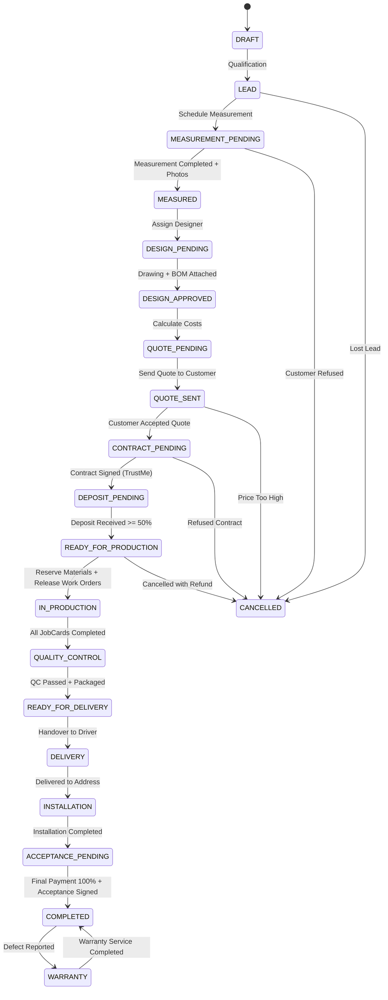

# Конечный автомат жизненного цикла мебельного заказа KORKEM (Order State Machine)

**Дата:** 2026-09-16  
**Версия:** 2.0  
**Статус:** Канонический переходный автомат (Finite State Machine)  
**Инвариант:** Бизнес-статус заказа никогда не хранится хаотичной строкой. Любой переход валидируется сервером, проверяет предусловия, права роли и генерирует событие в Transactional Outbox.

---

## 1. Граф состояний заказа (FSM State Diagram)



---

## 2. Полная матрица переходов (Transition Matrix)

| Исходный статус (`allowed_from`) | Целевой статус (`allowed_to`) | Разрешенная роль (`permission`) | Обязательные данные / Предусловия (`required_data`) | Побочные эффекты (`side_effects`) | Генерируемое событие (`outbox_event`) |
|---|---|---|---|---|---|
| **DRAFT** | **LEAD** | Sales, Admin, AI | Имя клиента, валидный телефон (WhatsApp) | Создание карточки Customer, генерация номера заказа | `lead.created` |
| **LEAD** | **MEASUREMENT_PENDING** | Sales, Measurer, AI | Адрес объекта, дата и подтвержденный слот времени | Создание задачи замерщику (`Task`) | `measurement.scheduled` |
| **MEASUREMENT_PENDING** | **MEASURED** | Measurer, Admin | Размеры помещения (длина, высота, углы), минимум 1 фото розеток/коммуникаций | Закрытие задачи замера, прикрепление файлов | `measurement.completed` |
| **MEASURED** | **DESIGN_PENDING** | Sales, Admin | Назначенный дизайнер | Создание задачи дизайнеру | `design.assigned` |
| **DESIGN_PENDING** | **DESIGN_APPROVED** | Designer, Director | Прикрепленный чертеж/PDF и файл БАЗИС XML | Генерация предварительного BOM и расчет м² | `design.approved` |
| **DESIGN_APPROVED** | **QUOTE_PENDING** | Sales, Estimator, AI | Ставка наценки цеха, расчетная себестоимость | Формирование документа Quotation | `quote.calculated` |
| **QUOTE_PENDING** | **QUOTE_SENT** | Sales, AI (после R10) | Утвержденная сумма сметы, телефон клиента | Отправка КП в WhatsApp/Telegram с PDF | `quote.sent` |
| **QUOTE_SENT** | **CONTRACT_PENDING** | Sales, Client | Письменное согласие клиента в чате или подпись | Генерация договора (TrustMe integration) | `quote.accepted` |
| **CONTRACT_PENDING** | **DEPOSIT_PENDING** | Sales, Accountant | Подписанный договор, указание графика платежей | Выставление счета на предоплату (Kaspi Pay) | `contract.signed` |
| **DEPOSIT_PENDING** | **READY_FOR_PRODUCTION** | Accountant, Kaspi Webhook | Подтвержденная оплата >= 50% от суммы договора | Проверка наличия материалов на складе | `payment.deposit_received` |
| **READY_FOR_PRODUCTION** | **IN_PRODUCTION** | Production Manager, Admin | Физическое наличие плит/кромки или подтвержденный резерв | Жесткий резерв сырья (`StockReservation`), генерация `Work Order` и `JobCard` цеха | `production.released` |
| **IN_PRODUCTION** | **QUALITY_CONTROL** | Shop Floor, QC Inspector | 100% операций сменных заданий закрыты мастерами | Назначение задачи контролеру ОТК | `production.all_jobs_completed` |
| **QUALITY_CONTROL** | **READY_FOR_DELIVERY** | QC Inspector, Production Manager | Чек-лист ОТК без замечаний, детали упакованы | Маркировка упаковок штрихкодами, оповещение логиста | `qc.passed` |
| **READY_FOR_DELIVERY** | **DELIVERY** | Logistics, Driver | Назначенный водитель, расходная накладная | Списание готовой продукции со склада цеха в зону доставки | `delivery.dispatched` |
| **DELIVERY** | **INSTALLATION** | Driver, Installer | Подтверждение доставки на адрес клиента | Активация задачи бригаде монтажников | `delivery.arrived` |
| **INSTALLATION** | **ACCEPTANCE_PENDING** | Installer, Crew Lead | Завершен монтаж, загружены фото собранного изделия | Запрос подписи Акта приема-передачи и остатка оплаты | `installation.completed` |
| **ACCEPTANCE_PENDING** | **COMPLETED** | Accountant, Admin, Kaspi | Подписанный Акт приема-передачи + 100% оплата | Перевод в архив, начисление зарплат мастерам, активация гарантии | `order.completed` |
| **COMPLETED** | **WARRANTY** | Support, Admin, AI | Обращение клиента с описанием дефекта и фото | Создание гарантийной рекламации (`WarrantyCase`) | `warranty.case_opened` |
| **WARRANTY** | **COMPLETED** | QC, Service Master | Акт устранения дефекта, подписанный клиентом | Закрытие рекламации | `warranty.case_resolved` |
| **ЛЮБОЙ (до отгрузки)**| **CANCELLED** | Director, Owner | Обязательное указание причины отмены | Снятие складских резервов, расчет возврата аванса | `order.cancelled` |

---

## 3. Архитектурная реализация State Machine в коде

Конечный автомат реализуется как чистый Python-класс `OrderStateMachine` внутри `korkem_manufacturing.services.order_state`:

```python
class OrderStateMachine:
    @classmethod
    def transition(
        cls,
        order_id: str,
        target_state: OrderState,
        actor: str,
        reason: str | None = None,
        context: dict | None = None
    ) -> TransitionResult:
        """
        Атомарно проверяет возможность перехода, валидирует предусловия,
        обновляет статус заказа, фиксирует аудит и отправляет событие в Outbox.
        """
        # 1. Чтение заказа с блокировкой строки (FOR UPDATE)
        # 2. Проверка: разрешен ли переход из текущего состояния в target_state
        # 3. Проверка прав роли текущего пользователя
        # 4. Проверка обязательных предусловий (Preconditions)
        # 5. Выполнение побочных эффектов перехода (Side Effects)
        # 6. Запись в Order History и Audit Trail
        # 7. Запись события в Transactional Outbox
        ...
```

---

## 4. Защита от тупиковых состояний и отката (Saga Rollbacks)

- Если на этапе перехода `READY_FOR_PRODUCTION -> IN_PRODUCTION` обнаруживается физическая нехватка хотя бы одного листа ЛДСП (дефицит), переход **блокируется**, статус остается `READY_FOR_PRODUCTION`, а снабженцу мгновенно генерируется `PurchaseRequest`.
- Заказ не может повиснуть в невалидном промежуточном состоянии: транзакция MariaDB откатывает любые частичные изменения при возникновении любого необработанного исключения.
