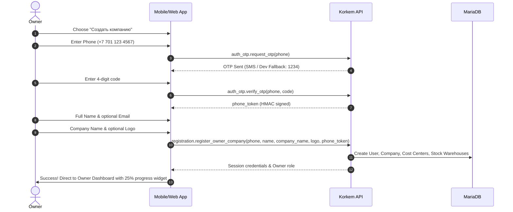

# KORKEM Flow v2: Native Onboarding and Company Invitations (Pilot P1)

## Executive Summary
During Real Workshop Pilot V1, initial onboarding friction was identified as a blocker for workshop owners and their craftsmen. The onboarding flow was redesigned to provide a 100% native, intuitive experience tailored specifically for furniture workshops in Kazakhstan and the CIS.

This redesign introduces:
1. **Two Strict Onboarding Paths**: Path A (Create Company for Owners) and Path B (Join Company by Invite for Employees).
2. **Kazakhstan-Friendly Phone OTP**: Native phone normalization (`+7 7XX XXX XX XX`) and OTP code verification.
3. **Logo Upload & Cyrillic Initials Fallback**: Instant workshop branding with automatic Cyrillic initials avatars (e.g., "Престиж Мебель" → "ПМ").
4. **`Company Invitation` DocType**: Secure SHA-256 token hashing, 7-day TTL, atomic 1-time acceptance, instant revocation, and strict multi-tenant boundary checks.
5. **Instant Sharing & Deep Links**: 1-tap WhatsApp / Telegram invitation dispatch, Android App Links (`https://korkem.asia/join/<token>`), custom URI scheme (`korkem://join/<token>`), and web landing page.
6. **Role-Based Workstation Landing**: Immediate redirection upon joining to role-specific modules (e.g. cutting operator directly to `/workstations/Раскрой`).
7. **Progressive Workshop Setup Widget**: Owner dashboard onboarding checklist starting at 25%.

---

## 1. Architecture & Data Model

### DocType: `Company Invitation` (`tabCompany Invitation`)
Located at: `backend/korkem_manufacturing/korkem_manufacturing/korkem_manufacturing/doctype/company_invitation/`

| Field | Type | Description |
|---|---|---|
| `company` | Link -> Company | The target furniture workshop (mandatory) |
| `token_hash` | Data (64 chars) | Cryptographic SHA-256 digest of secret invitation token |
| `token_preview` | Data (8 chars) | Safe non-secret prefix for UI audit and team list |
| `phone` | Data | Target phone number (optional) |
| `email` | Data | Target email address (optional) |
| `full_name` | Data | Target employee name (optional) |
| `role` | Select | Canonical workshop role (see Section 4) |
| `status` | Select | `PENDING`, `ACCEPTED`, `REVOKED`, `EXPIRED` |
| `invited_by` | Link -> User | User ID of workshop owner/admin |
| `expires_at` | Datetime | Expiration timestamp (default: 7 days from creation) |
| `accepted_at` | Datetime | Timestamp of atomic acceptance |
| `accepted_by` | Link -> User | User ID assigned to employee upon join |

### Security Invariants
- **Secret Tokens Never Persisted**: The raw 32-byte (64 hex char) random token is only generated in memory and returned once to the caller. The database persists solely the SHA-256 hash `hashlib.sha256(raw_token.encode()).hexdigest()`.
- **Atomic 1-Time Use**: Acceptance is executed in a database transaction with `FOR UPDATE` lock on `Company Invitation`. Once transitioned to `ACCEPTED`, replay attempts fail immediately.
- **Tenant Isolation**: Non-owners/admins cannot create invitations. Users belonging to Company A cannot view or revoke invitations belonging to Company B.
- **Strict Expiration**: Expired tokens (`now_datetime() > expires_at`) are automatically rejected with an explicit human-readable error.

---

## 2. Two Canonical Onboarding Paths

### Path A: Create Company (Owner Flow)
Designed to get a workshop owner up and running within 60 seconds without bureaucratic barriers (no BIN or bank accounts required):



### Path B: Join Company by Invite (Employee Flow)
Seamless entry via deep link (`https://korkem.asia/join/<raw_token>`) or manual invitation code entry:

```mermaid
sequenceDiagram
    autonumber
    actor Employee
    participant Link as WhatsApp / Telegram Link
    participant App as Mobile/Web App
    participant API as Korkem API
    participant DB as MariaDB

    Employee->>Link: Click invite link
    Link->>App: Open deep link /join/<token>
    App->>API: invitations.get_invitation_info(token)
    API-->>App: { company_name, role_title, initials, logo, status }
    App->>Employee: Show Workshop Card & Role Badge
    Employee->>App: Enter Phone (+7 777 987 6543) & Name
    App->>API: auth_otp.request_otp(phone)
    API-->>App: OTP Sent
    Employee->>App: Enter OTP Code
    App->>API: auth_otp.verify_otp(phone, code)
    API-->>App: phone_token
    App->>API: invitations.accept_invitation(token, full_name, phone, phone_token)
    API->>DB: Atomic acceptance & Frappe User creation & Role assignment
    API-->>App: Session credentials & Target Role
    App->>Employee: Redirect directly to Role Workstation (e.g., /workstations/Раскрой)
```

---

## 3. Workshop Identity & Initials Avatar
Furniture workshops often lack polished SVG logos during initial setup. KORKEM provides dual-mode visual identity:
1. **Custom Logo**: Image upload (PNG, JPG, WEBP) converted to base64, stored directly on the Company profile.
2. **Smart Cyrillic Initials**: If no logo is provided, initials are derived automatically:
   - "Престиж Мебель" → **ПМ**
   - "Korkem Mebel" → **KM**
   - "Авангард" → **АВ**
   - Displayed in a styled circular avatar with dynamic tinting matching workshop brand colors.

---

## 4. Role-Based Workstation Routing Matrix
Employees are never dumped into an empty or irrelevant settings page. Upon invitation acceptance, they are routed immediately to their dedicated operational view:

| Role Identifier | Role Title (RU) | Landing Route | Operational Module |
|---|---|---|---|
| `OWNER` | Владелец бизнеса | `/dashboard` | Executive KPI, cashflow & pipeline |
| `ADMIN` | Управляющий | `/dashboard` | Operational overview & approvals |
| `MEASURER` | Замерщик | `/measurements` | Client measurements & room specs |
| `DESIGNER_TECHNOLOGIST` | Дизайнер-технолог | `/orders` | 3D models, BASIS XML, cutting maps |
| `PRODUCTION_MANAGER` | Начальник цеха | `/production` | Shopfloor batching & workstation load |
| `CUTTING_OPERATOR` | Оператор раскроя | `/workstations/Раскрой` | Sheet cutting queue & offcut registration |
| `EDGEBANDING_OPERATOR` | Кромкооблицовщик | `/workstations/Кромление` | Edgebanding queue & edge roll usage |
| `CNC_OPERATOR` | Оператор ЧПУ | `/workstations/Присадка_ЧПУ` | CNC drilling and milling tasks |
| `ASSEMBLER` | Сборщик | `/workstations/Сборка` | Pre-assembly and hardware fitting |
| `INSTALLER` | Монтажник | `/installations` | On-site installation checklist & client signoff |
| `DRIVER` | Водитель / Доставка | `/delivery` | Packing slips, routing & delivery handoff |
| `ACCOUNTANT` | Бухгалтер | `/finance` | Payments, receivables & piece-rate payroll |

---

## 5. Team Management & Sharing (Web & Mobile)
Workshop owners and managers manage invitations in the **Команда** (Team) section:
- **Tabs**:
  - `Активные сотрудники (N)`: Active members, their assigned roles, and phone numbers.
  - `Приглашенные (M)`: Pending invitations with remaining TTL and quick actions.
- **1-Tap Messaging**:
  - **WhatsApp**: Pre-filled bilingual message (`https://wa.me/?text=...`)
  - **Telegram**: Direct share via `tg://msg_url` / `https://t.me/share/url`
  - **Copy Link**: Copies deep link and short invitation code to clipboard.
- **Revocation & Resend**: 1-click revocation marks invitation as `REVOKED`; resend resets 7-day TTL and produces a fresh invitation link.

---

## 6. Progressive Workshop Setup Checklist
To reduce owner anxiety after registration, the dashboard features an interactive setup progress widget:
- **Step 1 (25%)**: Регистрация компании (Done automatically upon registration).
- **Step 2 (50%)**: Пригласить первого сотрудника (CTA -> `/app/team` with share dialog).
- **Step 3 (75%)**: Создать первый заказ (CTA -> `/orders/new`).
- **Step 4 (100%)**: Начать производство (CTA -> `/production`).
The widget automatically dismisses itself once all 4 operational milestones are achieved.

---

## 7. Verification & Automated Test Suite

### Backend Integration Tests (`backend/korkem_manufacturing/korkem_manufacturing/test_company_invitations.py`)
Executed inside Frappe Bench container against MariaDB:

| Test Case | Method | Description | Result |
|---|---|---|---|
| TC-01 | `test_01_valid_invite_flow_end_to_end` | Complete invite creation, guest lookup, phone verification, and acceptance | **PASSED** (6.0s) |
| TC-02 | `test_02_expired_invite_rejected` | Invitation with past `expires_at` is strictly rejected | **PASSED** |
| TC-03 | `test_03_revoked_invite_rejected` | Revoked invitation cannot be accepted | **PASSED** |
| TC-04 | `test_04_replayed_invite_rejected` | Already accepted invitation cannot be reused | **PASSED** |
| TC-05 | `test_05_token_guessing_fails` | Invalid token returns permission/lookup error | **PASSED** |
| TC-06 | `test_06_cross_tenant_isolation` | Company A cannot view or revoke Company B invitations | **PASSED** |
| TC-07 | `test_07_non_admin_cannot_generate_invites` | Non-manager user blocked from inviting | **PASSED** |
| TC-08 | `test_08_role_assignment_matches_invited_role` | Employee receives correct role (ASSEMBLER -> Сборщик) | **PASSED** |
| TC-09 | `test_09_phone_otp_validation` | Validates Kazakhstan phone normalization and OTP checks | **PASSED** |
| TC-10 | `test_10_logo_and_initials_fallback` | Validates custom logo upload and Cyrillic initials derivation | **PASSED** (16.4s) |

**Overall Result**: 10 tests ran in 54.546s. **OK (0 failures, 0 errors)**.

### Mobile Flutter Tests (`mobile/korkem_flow/test/features/auth/`)
- `register_screen_test.dart`: Verifies 2-path segmented button, Step 1 phone OTP, Step 2 profile, Step 3 company details, and Step 4 completion -> **PASSED**.
- `join_invite_screen_test.dart`: Verifies token deep link resolution, workshop card display, Cyrillic initials avatar, phone OTP verification, and acceptance flow -> **PASSED**.
- `splash_screen_test.dart` & `password_toggle_test.dart`: Regression verification -> **PASSED**.

### Web Next.js Build (`web/`)
- Static site generation and typecheck across all 15 routes:
  - `/join/[token]` (Dynamic invitation page)
  - `/register` (2-path onboarding wizard)
  - `/app/team` (Active & Invited team tabs with WhatsApp/Telegram modals)
- **Result**: `Compiled successfully. Generating static pages (15/15). 0 errors.`
