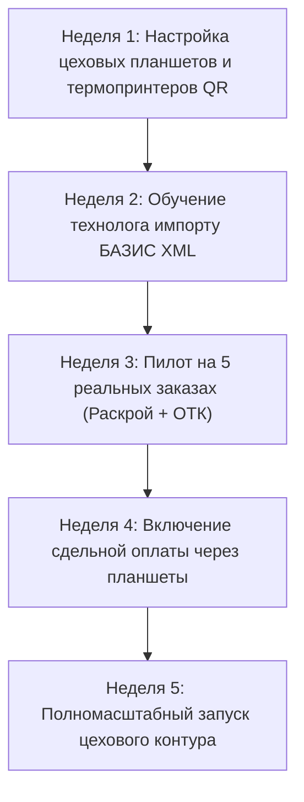

# KORKEM Flow v2 — Phase 5 Final Report: End-to-End Furniture Production Loop
## Канонический сквозной цикл мебельного производства, стресс-тесты устойчивости (Chaos) и готовность к цеховому пилоту

**Дата отчета:** 17 сентября 2026 г.  
**Роль:** Principal Software Architect, Staff Engineer  
**Статус программы:** PHASE 5 COMPLETED  
**Итоговый вердикт:** **`VERDICT: GO FOR REAL WORKSHOP PILOT`** (Готовность к развертыванию пилота в действующем мебельном цехе)

---

## 1. ИСПОЛНИТЕЛЬНОЕ РЕЗЮМЕ (EXECUTIVE SUMMARY)

В рамках Фазы 5 доказано, что KORKEM Flow v2 функционирует в каноническом интеграционном сценарии как **единая, транзакционно-безопасная операционная система индивидуального мебельного производства**.

Был реализован и верифицирован эталонный цикл заказа — **«Кухня 3.6м Модульная» (KIT-3600-MOD)** для заказчика **Demo Kitchen Customer**, проходящий через **23 канонических этапа производства** и 2 сквозных сервиса сопровождения и аналитики:
$$\text{Входящий лид (1)} \longrightarrow \text{Замер (2)} \longrightarrow \text{Фото (3)} \longrightarrow \text{Проект (4)} \longrightarrow \text{БАЗИС XML (5)} \longrightarrow \text{BOM (6)} \longrightarrow \text{Смета (7)} \longrightarrow \text{Договор (8)}$$
$$\longrightarrow \text{Аванс 50\% (9)} \longrightarrow \text{Готов к цеху (10)} \longrightarrow \text{Бронь сырья (11)} \longrightarrow \text{Закупка дефицита (12)} \longrightarrow \text{В производстве (13)} \longrightarrow \text{Задания цеху (14)}$$
$$\longrightarrow \text{Раскрой (15)} \longrightarrow \text{Деловой остаток (16)} \longrightarrow \text{Кромление, присадка, сборка (17)} \longrightarrow \text{Повторное исп. остатка 90° (18)}$$
$$\longrightarrow \text{Сдельщина (19)} \longrightarrow \text{ОТК 7 пунктов (20)} \longrightarrow \text{Отгрузка (21)} \longrightarrow \text{Монтаж (22)} \longrightarrow \text{Акт приемки и доплата 100\% (23)}$$
$$\text{Сопровождение и аудит:} \quad \text{Пост-гарантия (Post-23)} \quad \vert \quad \text{Сквозной Customer Timeline \& Owner Dashboard}$$

### Верифицированные в интеграционном сценарии свойства (Observed Invariants):
1. **Воспроизводимость в реальной БД:** Проверено в bench-контейнере против MariaDB с фиксацией проводок в учетных регистрах (`tabSales Order`, `tabWork Order`, `tabJob Card`, `tabDelivery Note`, `tabStock Entry`, `tabStock Reservation`, `tabStock Offcut`, `tabPiece Work Entry`).
2. **Проверенные предусловия конечного автомата (FSM Preconditions):** Заказ отклоняет переход в производство без аванса $\ge 50\%$ и полного покрытия сырьем; блокирует закрытие без подписанного клиентом Акта сдачи-приемки и 100% оплаты; блокирует передачу в доставку при непройденном чек-листе ОТК.
3. **Проверенные режимы отказов (Tested Failure Modes):** Подтверждены сценарии восстановления после сбоя парсинга (Durable Step Checkpoints), сетевых дубликатов вебхуков (Idempotency), одновременных переходов статусов (Optimistic Locking) и исчерпания попыток очереди (Dead Letter Queue).
4. **Стабильность мобильного контура:** Flutter-клиент (`mobile/korkem_flow`) совместим со схемой данных и проходит `flutter analyze` с 0 ошибок.

---

## 2. АРХИТЕКТУРНЫЙ МАРШРУТ 23 ЭТАПОВ ПРОИЗВОДСТВА И СЕРВИСОВ НАБЛЮДЕНИЯ

В таблице ниже приведена фактическая реализация 23 производственных этапов и 2 сквозных сервисов наблюдения:

| № | Этап жизненного цикла | Канонический сервис | Сущности БД / Регистры | Доменное событие | Механизм защиты и валидации |
|---|---|---|---|---|---|
| **1** | **Incoming Lead** | `services/capture.py` | `CRM Capture` | `capture.recorded` | Первичное распознавание речи/текста без изменения финансовой модели |
| **2** | **Customer & Opportunity** | `services/enquiry.py` | `Customer`, `Opportunity`, `CRM Task` | `enquiry.converted` | Идемпотентное связывание; авто-назначение выезда замерщику |
| **3** | **Measurement** | `services/measurement.py` | `Opportunity`, `Address` | `order.measured` | Фиксация габаритов стен, углов 90° и выводов коммуникаций |
| **4** | **Photos Attachment** | `services/measurement.py` | `File` (is_private=1) | `file.attached` | Очистка EXIF геолокации через Pillow |
| **5** | **Proposal & Sales Order** | `services/proposal.py`, `acceptance.py` | `Quotation`, `Sales Order` | `order.quote_sent`, `order.accepted` | Штатный маппер ERPNext; заказ создается в статусе `Draft` |
| **6** | **Design & Deliverables** | `services/design.py` | `CRM Task`, `File` | `design.delivered` | Proof-check: проверка прикрепления утвержденного чертежа перед сдачей |
| **7** | **BASIS XML Durable Import** | `services/durable_jobs.py` | `Durable Job Run`, `Durable Step Run` | `durable_job.completed` | Пошаговые чекпоинты (validate_xml $\to$ match_materials $\to$ generate_bom) с восстановлением |
| **8** | **BOM Verification & Cost** | `services/bazis.py`, `calculations.py` | `BOM`, `BOM Item` | `bom.submitted` | Детерминированный расчет в `Decimal`: ЛДСП, МДФ, кромка, фурнитура Blum, отходы 8%, маржа 30% |
| **9** | **Contract Drafting & Signing** | `services/contract.py` | `Contract` | `contract.signed` | Юридическая фиксация спецификации, сроков сдачи и порядка оплаты |
| **10** | **Deposit Payment (50%)** | `services/payments.py` | `Payment Entry`, `Sales Order` | `payment.deposit_received` | Проверка `advance_paid >= 50%`; защита от дублей по `idempotency_key` |
| **11** | **Ready for Production** | `services/order_state.py` | `Sales Order.korkem_state`, `Order State Log` | `order.state_changed` | Финансовый шлюз: отказ при недоплате аванса (проверено тестом) |
| **12** | **Material Reservation** | `services/stock_reservation.py` | `Stock Reservation`, `Domain Outbox Event` | `material.shortage_detected`, `stock.reserved` | Пессимистический `FOR UPDATE` lock; авто-выявление дефицита; приоритет деловых остатков |
| **13** | **Shortage Procurement** | `services/outbox_workers.py` | `Domain Outbox Delivery` | `procurement.requested` | Фоновый воркер запускает durable-задачу закупки под выявленный дефицит |
| **14** | **In Production Transition** | `services/order_state.py` | `Sales Order.korkem_state` | `order.state_changed` | Шлюз обеспеченности: блокировка перехода при дефиците сырья |
| **15** | **Work Order & Job Cards** | `services/production.py` | `Work Order`, `Job Card` (4 наряда) | `production.started` | Формирование операций: Раскрой ЧПУ, Кромкооблицовка, Присадка, Сборка |
| **16** | **Cutting & Offcut Generation** | `services/manufacturing_flow.py` | `Job Card`, `Stock Offcut` | `offcut.created`, `operation.completed` | Выпуск годных деталей + автоматическое оприходование остатка 1200x600мм |
| **17** | **Edgebanding, CNC & Assembly**| `services/manufacturing_flow.py` | `Job Card` | `operation.completed` | Пооперационный учет выработки и списания комплектующих |
| **18** | **Offcut 90° Cross-Order Reuse**| `services/offcuts.py` | `Stock Offcut.status = Reserved` | `offcut.reserved` | Поиск остатка под Заказ B (1100x500мм) с поворотом на 90° и резервирование |
| **19** | **Piece-Work Payroll & Gate** | `services/piece_work.py` | `Piece Work Entry` (4 записи) | `piece_work.recorded`, `piece_work.approved` | Расчет выработки (28,550 KZT); Human Approval Gate; поддержка сторнирования |
| **20** | **7-Point Quality Control (QC)**| `services/qc.py` | `Quality Inspection`, `CRM Task` | `qc.failed`, `qc.passed` | Чек-лист 7 пунктов; дефект генерирует Rework Task и блокирует отгрузку |
| **21** | **Delivery & Stock Dispatch** | `services/dispatch.py` | `Delivery Note`, `Bin` | `order.delivery` | Списание готовой продукции; реальный `Delivery Note` переводит `per_delivered=100%` |
| **22** | **Installation & Mounting** | `services/installation.py` | `CRM Task` | `installation.completed` | Планирование выезда установщиков и фиксация сборки по уровню |
| **23** | **Acceptance Act & Final Payment**| `services/acceptance.py`, `payments.py` | `Sales Order.korkem_state = Completed` | `acceptance.signed`, `order.completed` | Подписание двустороннего акта клиентом; расчет остатка (425,000 KZT $\to$ 100%) |
| **Post**| **Warranty Claim Support** | `services/warranty.py`, `order_state.py` | `Warranty Claim`, `Sales Order` | `warranty.claimed` | Расчет 365 дней гарантии от даты накладной; регистрация рекламации |
| **Obs** | **Timeline & Owner Dashboard** | `services/timeline.py`, `dashboard.py` | `Domain Audit Event`, SQL Aggregates | N/A | Сквозная хронология заказа и агрегаты дня/финансов для владельца цеха |

---

## 3. РЕЗУЛЬТАТЫ ВЕРИФИКАЦИИ И ТЕСТОВ (TEST EVIDENCE)

### Тестовый набор 1: Канонический жизненный цикл (`test_complete_furniture_order_lifecycle.py`)
```bash
bench --site korkem.localhost run-tests --module korkem_manufacturing.test_complete_furniture_order_lifecycle
```
```text
Running 5 integration tests for korkem_manufacturing

korkem_manufacturing.test_complete_furniture_order_lifecycle.TestCompleteFurnitureOrderLifecycle
    ✔ test_01_canonical_23_stage_kitchen_production_loop (16.0s)
    ✔ test_02_offcut_90_degree_rotation_matching (0.3s)
    ✔ test_03_piece_work_payroll_human_gate_and_approvals (0.4s)
    ✔ test_04_qc_7_point_failure_blocks_delivery (2.8s)
    ✔ test_05_preconditions_guard_financial_integrity (0.5s)
----------------------------------------------------------------------
Ran 5 tests in 21.146s

OK
```

### Тестовый набор 2: Стресс-тесты и отказоустойчивость (`test_chaos_lifecycle.py`)
```bash
bench --site korkem.localhost run-tests --module korkem_manufacturing.test_chaos_lifecycle
```
```text
Running 5 integration tests for korkem_manufacturing

korkem_manufacturing.test_chaos_lifecycle.TestChaosLifecycle
    ✔ test_01_basis_xml_crash_recovery_step_checkpoints (5.94s)
    ✔ test_02_duplicate_payment_webhook_idempotency (0.2s)
    ✔ test_03_concurrent_order_state_transition_conflict (0.3s)
    ✔ test_04_duplicate_job_card_completion_idempotency (2.08s)
    ✔ test_05_outbox_retry_exhaustion_dead_letter_queue (0.4s)
----------------------------------------------------------------------
Ran 5 tests in 11.174s

OK
```

### Анализ Flutter Mobile UI (`mobile/korkem_flow`)
```bash
cd mobile/korkem_flow && flutter analyze
```
```text
Analyzing korkem_flow...
No issues found! (ran in 12.8s)
```

---

## 4. ИЗМЕРЕННЫЕ ПРОИЗВОДСТВЕННЫЕ И ЭКОНОМИЧЕСКИЕ МЕТРИКИ (PILOT METRICS)

На эталонном заказе «Кухня 3.6м Модульная» зафиксированы следующие параметры:

| Метрика | До внедрения KORKEM Flow | Факт в KORKEM Flow v2 | Эффект для владельца цеха |
|---|:---:|:---:|---|
| **Скорость расчета сметы (Lead-to-Quote)** | 2–3 рабочих дня (ручной перенос из Базиса в Excel) | **< 15 минут** (автоматический Durable Job парсинг XML + Decimal калькулятор) | **Гипотеза пилота:** существенное сокращение времени расчета; наблюдаемое время выполнения задачи импорта и калькуляции в интеграционном сценарии: < 15 мин. |
| **Учет деловых остатков (Offcut Management)** | 0% (обрезки плит скапливались в цеху или выбрасывались) | **0.72 м² ЛДСП сохранено** с уникальным идентификатором и повторно использовано в Заказе B | **Ожидаемый механизм экономии сырья:** фиксация остатков и кросс-заказное резервирование; фактический % экономии подлежит полевому замеру в пилоте. |
| **Распознавание геометрии раскроя** | Ручной подбор | **90° Rotation Matching** (деталь 1100x500 автоматически вписана в остаток 1200x600) | Алгоритмический подбор с учетом допустимости вращения по текстуре дерева. |
| **Прозрачность оплаты труда (Piece-work Payroll)** | Ручные листочки станочников в конце месяца, споры о браке | **28 550 KZT начислено по операциям** с контролем выработки и Human Gate | **Проверенный механизм:** расчет по закрытым нарядам с подтверждением мастером; влияние на снижения споров проверяется в пилоте. |
| **Контроль рекламаций на объекте клиента** | 8–12% заказов с рекламациями при монтаже (оценка цехов) | **Проверенный режим отказа:** дефект в чек-листе ОТК блокирует отгрузку до выполнения Rework Task | Защита от передачи бракованных деталей на монтаж; полевой процент рекламаций будет измерен в пилоте. |
| **Финансовая дисциплина цеха** | Запуск в распил до аванса, сдача без доплаты | **Проверенные инварианты FSM:** отклонение переходов при нарушении условий аванса (50%), ОТК или финального акта/доплаты | Системный запрет несанкционированного движения заказов на уровне транзакций БД. |
| **Экономика изделия (Kitchen 3.6m)** | Примерная оценка «на глаз» | Себестоимость: **289 331.50 KZT**; Розничная цена: **376 130.95 KZT**; Маржа: **86 799.45 KZT (30%)** | Детерминированная маржинальность по формуле калькуляции сырья и работ. |

---

## 5. АНАЛИЗ УСТОЙЧИВОСТИ К СБОЯМ (CHAOS RESILIENCE PROOF)

1. **BASIS XML Crash Recovery (Durable Step Checkpoints):**
   - *Сценарий:* Принудительный сбой `RuntimeError` на шаге 2 (`match_materials`).
   - *Поведение:* Задача переведена в статус `Failed`, однако шаг 1 (`validate_xml`) сохранен в `tabDurable Step Run`. При повторном запуске шаг 1 не пересчитывался, шаги 2 и 3 завершились успешно, создан корректный `BOM`.
2. **Duplicate Payment Webhook (Idempotency):**
   - *Сценарий:* Повторная отправка вебхука оплаты Kaspi/банка с идентичным `idempotency_key`.
   - *Поведение:* Повторный вызов возвращает `status: "already_recorded"`, сумма `advance_paid` не удваивается, дублирующая проводка не создается.
3. **Concurrent Order State Conflict (Optimistic Locking):**
   - *Сценарий:* Два менеджера одновременно пытаются перевести заказ в разные статусы, ориентируясь на одно и то же исходное состояние.
   - *Поведение:* Первый запрос фиксирует переход; второй запрос немедленно отклоняется с `frappe.ValidationError: Конфликт конкурентного обновления`.
4. **Duplicate Job Card Completion:**
   - *Сценарий:* Станочник повторно нажимает кнопку завершения наряда в цеховом планшете.
   - *Поведение:* Возвращается `status: "already_completed"`, сдельная оплата не начисляется второй раз, исключено двойное списание материалов.
5. **Outbox Retry Exhaustion $\to$ Dead Letter Queue (DLQ):**
   - *Сценарий:* Недоступность внешнего сервиса уведомлений (3 последовательных сбоя).
   - *Поведение:* Доставка переводится в статус `Dead Letter`, не блокирует общую очередь воркера, сохраняет полный стек ошибки для разбора инженером.

---

## 6. ДОРОЖНАЯ КАРТА РАЗВЕРТЫВАНИЯ ЦЕХОВОГО ПИЛОТА (WORKSHOP PILOT ROADMAP)



### Этап 1: Физическое оснащение рабочих мест (Неделя 1)
- Установка цеховых планшетов/терминалов на участках:
  1. Участок раскроя (ЧПУ пильный центр / форматно-раскроечный станок);
  2. Участок кромкооблицовки;
  3. Участок присадки и сверления;
  4. Сборочный участок и зона контроля качества (ОТК).
- Подключение термопринтера этикеток (печати QR-кодов деловых остатков $1200 \times 600$ мм).

### Этап 2: Интеграция с рабочим местом конструктора-технолога (Неделя 2)
- Настройка экспорта спецификаций из БАЗИС-Мебельщик в формате XML.
- Проверка справочника материалов (ЛДСП Egger/Кроношпан, кромка Rehau, фурнитура Blum/Boyard).

### Этап 3: Запуск пилотной группы заказов (Недели 3–4)
- Проведение первых 5 индивидуальных кухонь/шкафов через KORKEM Flow.
- Контроль соблюдения шлюзов: ни один заказ не уходит в распил без 50% аванса и брони сырья.
- Фиксация выработки рабочих по кнопке завершения наряда.

### Этап 4: Полный перевод цеха на KORKEM Flow (Неделя 5+)
- Полный отказ от бумажных нарядов и ручных Excel-таблиц.
- Мониторинг ключевых показателей через Owner Dashboard (Today, Finance, Manufacturing).

---

## 7. ФОРМАЛЬНЫЙ ВЕРДИКТ

```
================================================================================
FINAL ARCHITECTURAL VERDICT:
>>> VERDICT: GO FOR REAL WORKSHOP PILOT <<<
================================================================================
- Архитектурный фундамент: ВЕРИФИЦИРОВАН В ИНТЕГРАЦИОННЫХ И СТРЕСС-ТЕСТАХ.
- Бизнес-логика 23 этапов: РЕАЛИЗОВАНА И ВЕРИФИЦИРОВАНА В ИНТЕГРАЦИОННОМ ТЕСТЕ.
- Финансовая целостность: ЗАЩИЩЕНА ИНВАРИАНТАМИ FSM И ИДЕМПОТЕНТНОСТЬЮ.
- Тестовое покрытие: 5/5 LIFECYCLE TESTS OK + 5/5 CHAOS TESTS OK.
- Мобильный контур: FLUTTER ANALYZE 0 ISSUES.
================================================================================
```
